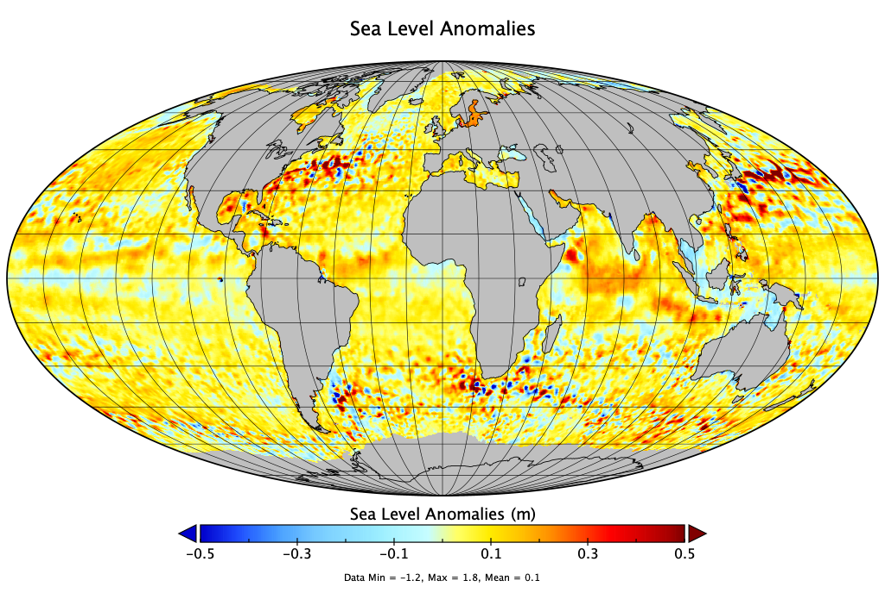

# Altimetry

This lecture is also available as part of an audio-narrated [PowerPoint presentation](https://oceanwatch.pifsc.noaa.gov/files/hawaii2020/05-Salinity-Winds-Altimetry.pptx).

## What is altimetry? 

The surface of the ocean isn’t flat -- there are high spots and low spots.

Satelllite altimeters measure the ocean surface height in relation to the mean sea level. Altimetry data helps identify areas of upwelling and downwelling and the location of ocean current features and eddies.

## Basic principle 

https://www.star.nesdis.noaa.gov/socd/lsa/AltBathy/

Satellite altimeters are **active microwave** instruments \(-&gt; not affected by cloud cover\)

Altimeters on board the satellites send signals at high frequencies \(over 1,700 pulses per second\) to Earth’s surface and receive the echoes from the surface.

The return time of the signal gives a measure of distance to the surface \(**range,** R\)

However, as electromagnetic waves travel through the atmosphere \(twice\), they can be decelerated by water vapor or ionization.

 -&gt; need atmospheric correction for accurate measurements

The precise position of the satellite is tracked using Doppler shift, GPS or lasers, to determine the **satellite altitude,** which is the distance to a standard reference \(**ellipsoid**\).

The range is subtracted from the altitude of the satellite to give **Sea Surface Height** \(SSH\).

Altimetry data has an accuracy of ~ 3cm !! But a low resolution \(~ 25 km\), and no coverage close to the coasts \(20km\).

## Sea Surface Height 

The sea surface height \(SSH\), is the satellite’s distance at a given instant from the reference surface, so:

 SSH = Altitude – Range.

For the ocean, the sea surface height integrates effects such as:

 - The sea surface height which would exist without any perturbing factors \(wind, currents, tides, etc.\). This surface, known as the geoid, is determined by gravity variations around the world, which are in turn due to major mass and density differences on the seafloor.

 - The ocean circulation, or dynamic topography, which comprises:

* the permanent stationary component \(permanent circulation linked to Earth’s rotation, permanent winds, etc.\). The mean effect is of the order of one meter.
* a highly variable component \(due to wind, eddies, seasonal variations, etc.\).

## Sea Level Anomalies 

A **sea level anomaly** \(SLA\) is the difference between the total sea-level and the average sea-level for a particular time of year.

We look at anomalies because the total level measurement made by the altimeter varies from +/- 100 meters. Most of this is constant, though, and is due to the Earth's gravity \(geoid\) and the ocean circulation.

Sea level variations caused by El Niño for example account for only 1% of the signals. If the constant part was not removed, the El Niño signal would not be observable.

To derive the dynamic topography, the easiest way would be to subtract the geoid height from SSH. In practice, mean sea surface is subtracted instead, to yield the variable part \(sea level anomalies\) of the ocean signal.

SLA = SSH – MSS

MSS represents the mean profile of the SSH over a defined temporal period, also called reference period \(currently 1993-2012\).

https://duacs.cls.fr/faq/what-are-the-product-specification/altimeter-reference-period-and-absolute-reference/

## Geostrophic currents 

At large space scales in the ocean, pressure gradients due to gradients in sea level are balanced by the Coriolis force and associated geostrophic currents.

SLA obtained from satellite altimetry measurements is used to derive surface geostrophic currents.

http://www.seos-project.eu/modules/oceancurrents/oceancurrents-c06-s02-p01.html

## Geostrophic currents & SLA 

Son et al, 2014

Average geostrophic currents – 1992 -2002, Cheng et al, 2014

## Eddies 

Eddies can be identified from SLA.

Cheng et al, 2014

The spatial and temporal resolutions of SLA are 25 km and 7 days, respectively, thus an eddy diameter smaller than 50 km or a lifespan shorter than one week can not be detected using altimetry data.

## Altimetry missions 

CLS/CNES

## Current missions 

From: Eric Leuliette, NOAA/NESDIS

## Current constellation coverage 

Jason-2, Jason-3, Sentinel-3A, AltiKa, Cryosat-2. From: Eric Leuliette, NOAA/NESDIS

Much of the ocean surface is interpolated: low spatial resolution ~ 25km, 7 days

## Data products 

* AVISO data. Distributed by CMEMS \(Europe\). Free for research purposes but need to register to get access. [http://marine.copernicus.eu/services-portfolio/access-to-products](http://marine.copernicus.eu/services-portfolio/access-to-products/)​[/](http://marine.copernicus.eu/services-portfolio/access-to-products/)
* 

From: Eric Leuliette, NOAA/NESDIS

​

## References 

* * * * * * Son et al 2014. A newly observed physical cause of the onset of the subsurface spring phytoplankton bloom in the southwestern East Sea/Sea of Japan. Biogeosciences 11\(5\)
* Cheng et al, 2014. Statistical Characteristics of Mesoscale Eddies in the North Pacific Derived from Satellite Altimetry. Remote Sensing 6\(6\)

​ ​

​ ​

