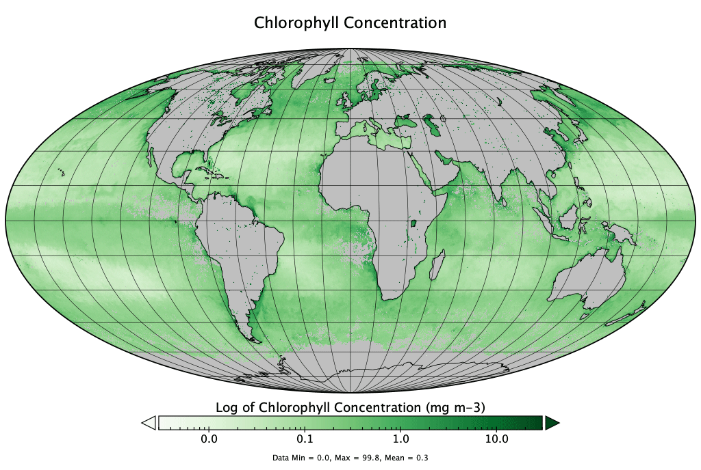

# Ocean Color

This lecture is also available as an audio-narrated [PowerPoint presentation](https://oceanwatch.pifsc.noaa.gov/files/hawaii2020/03-Ocean_Color.pptx).

## Objectives 

Establish baseline vocabulary/concepts:

* How is ocean color measured from space
* Spectral characteristics of oceanic waters
* Sensor bands
* True color images
* Sun glint
* Ocean color data products
* Case-1 vs case-2 waters
* Sensors
* ESA-CCI product
* Multi-spectral vs. Hyper-spectral sensors

## Why ocean color? 

It is feasible to measure phytoplankton pigments, and productivity on a global scale.

This feasibility rests squarely on two observations:

1. There exists a more or less universal relationship between the color of the ocean and the phytoplankton pigment concentration for most open ocean waters
2. It is possible to develop algorithms to remove the interfering effects of the atmosphere from the imagery.

Ocean color measurements from space have revolutionized our understanding of the ocean on every scale, from local to global and from days to decades.

Ocean color measurements reveal a wealth of ecologically important characteristics including:

* chlorophyll concentration \(a proxy for the biomass of marine plants or phytoplankton\)
* the rate of phytoplankton photosynthesis
* sediment transport
* dispersion of pollutants
* responses of oceanic biota to long-term climate changes

## What causes variation in the color of the ocean? 

## Reminder: What is measured by the sensors? 

Ocean color measurements focus on light emitted in the visible range

From: Jeremy Werdell, NASA

## Light Penetration 

Transmission of light in “pure” fresh or saltwater

* Blue light is scattered by clear water
* Red light is absorbed

Algae and tannins absorb blue and green -&gt; the water looks more brownish

## Definitions 

* **Downwelling irradiance**: Ed Flux of light passing down through the sea surface into the water column
* **Water-leaving radiance**: Lw A measure of how much light is leaving the sea surface and subsequently propagates to the top of the atmosphere
* **Remote sensing reflectance**: RRS A measure of the proportion of the downwelling light that is reflected back up from the water below. It contains the spectral color information of the water body \(below the sea surface\). Rrs is the ratio between the water-leaving radiance \(Lw\) and the downwelling irradiance \(Ed\).

RRS=Lw/EdRRS = Lw/EdRRS=Lw/Ed

* **Absorption**: a Absorption of light takes place when matter captures electromagnetic radiation, converting the energy of photons to heat.
* **Scattering**: b Light scattering changes the direction of photon transport, “dispersing” them as they penetrate a sample, without changing their wavelength.
* Both absorption and scattering reduce the light energy in a beam as it travels through water. While scattering redirects the angle of the photon path, absorption removes the photons permanently from the path.
* Reflectance is related to absorption and scattering:

 RRS ~ coeff \* b/a

Reflectance is affected by the concentration of pigments in the water

## Reminder: Electromagnetic radiation \(EMR\) 

Credit: Jan Yoshioka, CI

## Steps for deriving ocean color data products from space 

Deriving biological parameters from ocean color measurements is a multi-stage process.

* Ocean color radiometric sensors measure the upwelling radiance at the top of the atmosphere \(LTOA\). LTOA is the total radiance from three sources:
  * **water-leaving \(Lw\) radiance**
  * radiance reflected from the sea surface \(**surface-reflected radiance**\)
  * radiance scattered into the viewing direction by the atmosphere along the path between the sensor and sea surface \(**atmospheric path radiance**\).
* Of these three radiance sources, **the desired measurement is Lw**. Lw carries information about the biological and chemical constituents in the near-surface waters.
* To obtain Lw, it is necessary to deduce and remove the contributions of surface reflection and atmospheric path radiance from the measured total, a process known as **atmospheric correction**. This is difficult because Lw is no more than 10 percent of LTOA.

From: Jeremy Werdell, NASA

## Atmospheric correction 

From: Jeremy Werdell, NASA

The water signal is often less than 10% of the total signal measured by the sensor

-&gt; good atmospheric correction is critical

## “Ocean color” enables studying microscopic marine features from space 

From: Jeremy Werdell, NASA

From: Jeremy Werdell, NASA

The color of the ocean is a function of light that is absorbed or scattered as a result of constituents in the water.

* Phytoplankton and pigments
* Dissolved organic matter
* Detritus \(fecal pellets, dead cells\)
* Inorganic particles \(sediment\)
* Water absorption

## Reminder: Sensor bands 

Multispectral radiometers measure EMR intensity at a few discrete wavelength regions. Each wavelength region is defined by a central wavelength and a small range of wavelengths around it \(a bandwidth\)

The intensity of EMR at each wavelength region is stored separately in a stack of digital images. Each separate image is called a wavelength band or a wavelength channel.

Each band or channel can be referred to by its central wavelength value or by sequential numbering \(1, 2, 3, …\) of each band from shortest to longest wavelength

## Absorption Spectra and MODIS bands 

Sensor bands are chosen to target specific peaks in absorption spectra.

MODIS bands

## Various pigments in algae = various peaks in absorption 

From: S. Berg, Winona State

## Spectral characteristics of oceanic waters 

## Reminder: Higher order products 

Example of Using Band Combinations to Make Higher Order Products

In this case making a true color image from the addition of separate R, G and B bands.

Intensity of the 8 Visible and Near-Infrared Bands from the SeaWiFS Sensor for the East Coast of the United States:

True-Color Image Created from bands 2, 5, and 6 corresponding to wavelengths 443, 555 and 670 nm \(+/-10 nm\)

Final Color Image = C1\*band2 + C2\*band5 + C3\*band6

## True Color Images - VIIRS 

You can visualize or download True Color images from:

Algae bloom in the east part of the Black Sea on June 3, 2012

Sand storm carrying sand from West Africa over Atlantic Ocean on February 27, 2015

Vog from Kilauea Eruption, June 18, 2018

## Sunglint 

Sunglint is the mirror reflection of sunlight off the sea surface.

Its signal is so much greater than the light reflected from below the surface that retrieval of information about in-water constituents by direct measurement is severely compromised, often impossible.

In regions where there is a low to moderate glint signal, it is possible to estimate the contribution of sun glint to the total signal.

For example, MODIS/Aqua crosses the equator in the early afternoon when the sun is a bit west of the sensor, and hence has sunglint issues to the west of the swath's center line, whereas MODIS/Terra has its glint region to the east of the center line because Terra crosses the equator in the late morning when the sun is a bit to the east of the sensor.

Sunglint on a 24h VIIRS True Color image

It is not possible to estimate chlorophyll concentration where there is sunglint or clouds….

Sunglint in 24h VIIRS chlorophyll-a concentration data

-&gt; need to use composites to “fill in” the gaps.

## Chlorophyll-a concentration 

Chlorophyll-a concentration is estimated by looking at the ratio of different blue and green bands.

## Ocean color data products 

From: Jeremy Werdell, NASA

## Kd490 

The diffuse attenuation coefficient in water indicates how strongly light intensity at a specified wavelength is attenuated within the water column. This parameter has wide applicability in ocean optics, as it is directly related to the presence of scattering particles in the water column, either organic or inorganic, and thus is an indication of water clarity.

The diffuse attenuation coefficient at 490 nm \(Kd490\) indicates the turbidity of the water column – i.e. how visible light in the blue to green region of the spectrum penetrates within the water column. The value of Kd490 represents the rate at which light at 490 nm is attenuated with depth.

For example a Kd490 of 0.1/meter means that light intensity will be reduced one natural log within 10 meters of water. Thus, for a Kd490 of 0.1, one attenuation length is 10 meters.

Higher Kd490 value means smaller attenuation depth, and lower clarity of ocean water.

## PAR 

The photosynthetically available radiation \(PAR\) designates the spectral range \(wave band\) of solar radiation from 400 to 700 nm that photosynthetic organisms are able to use in the process of photosynthesis.

The solar energy available for photosynthesis, known as PAR, controls the growth of phytoplankton and, therefore, the development of crustaceans, fish, and other consumers. It ultimately regulates the composition and evolution of marine ecosystems. Knowing the distribution of PAR over the oceans, spatially and temporally, is critical to understanding bio-geo-chemical cycles of carbon, nutrients, and oxygen, and to address important climate and global change issues such as the fate of anthropogenic atmospheric carbon dioxide.

For ocean color applications, PAR is a common input used in modeling marine primary productivity.

With Kd490, PAR \(& some assumptions\), we can calculate PAR at depth.

From: Frouin & Murakami, 2007

## Primary Productivity 

Primary production is the rate of production of phytoplankton.•The growth requirements of phytoplankton are similar to those of any green plant: Water, Carbon dioxide, Visible light, Chemical nutrients \(nitrogen, phosphorus, ... often in short supply\)

Primary production varies with region and season, because of changes in those factors essential for phytoplankton growth. These include:

* the phytoplankton biomass
* the intensity and duration of sunshine
* the intensity of turbulence in the water
* the concentration of certain chemicals \(nutrients\) in the water
* the temperature
* the kinds of phytoplankton present.

Primary productivity can be estimated globally from chlorophyll a concentration, PAR, SST and day length.

Many different models exist. References: [http](http://www.science.oregonstate.edu/ocean.productivity/vgpm.model.php)​[://](http://www.science.oregonstate.edu/ocean.productivity/vgpm.model.php)​[www.science.oregonstate.edu/ocean.productivity/vgpm.model.php](http://www.science.oregonstate.edu/ocean.productivity/vgpm.model.php) [http://](http://www.science.oregonstate.edu/ocean.productivity/references/L&O%201997a.pdf)​[www.science.oregonstate.edu/ocean.productivity/references/L&O%201997a.pdf](http://www.science.oregonstate.edu/ocean.productivity/references/L&O%201997a.pdf) [http://](http://www.ifado.eu/wp-content/uploads/2018/08/Lobanova_etal_RemoteSensing_2018-1.pdf)​[www.ifado.eu/wp-content/uploads/2018/08/Lobanova\_etal\_RemoteSensing\_2018-1.pdf](http://www.ifado.eu/wp-content/uploads/2018/08/Lobanova_etal_RemoteSensing_2018-1.pdf)

ESA – May 2004, using OC-CCI data

## Phytoplankton Composition 

Satellite ocean color data is used to derive phytoplankton functional groups using a series of Remote Sensing Reflectance \(RRS\) band ratio algorithms at 490, 555 and 670 nm.

From: Kim Hyde and colleagues, NOAA

## Case-1 versus Case-2 waters 

## Optically-shallow waters 

Remotely sensed ocean color algorithms are calibrated for optically-deep waters, where the signal received by the satellite sensor originates from the water column without any bottom contribution.

Optically shallow waters are those in which light reflected off the seafloor contributes significantly to the water-leaving signal. This is known to effect geophysical variables derived by ocean-color algorithms, often leading to biased values

In the tropical Pacific, optically-deep waters are typically deeper than 15 – 30 m.

In optically-shallow waters such as lagoons, regions within atolls, and most coral reef environments, bottom substrate properties and sediment suspension may affect light propagation, which increases marine reflectance and data quality issues when quantifying in-water constituents, such as chlorophyll-a.

It is recommended to remove shallow-pixels \(&lt;30m depth\) from the study area before computing ocean color metrics.

\(Gove et al, 2013, McKinna&Werdell, 2018\)

From: McKinna&Werdell, 2018

The Pedro Bank, a highly reflective shallow region southwest of Jamaica, and other shallow features are associated with anomalously high retrievals of chlorophyll-a concentrations.

## Global Ocean Color Sensors 

## ESA CCI 

Different sensors don’t match during their periods of overlap, making it challenging to study long-term trends.

The European Space Agency \(ESA\) started the Climate Change Initiative \(CCI\) to generate satellite-based Essential Climate Variables to allow assessing long-term trends from satellite products.

The dataset is created by band-shifting and bias-correcting MERIS, MODIS and VIIRS data to match SeaWiFS data, merging the datasets and computing per-pixel uncertainty estimates.

More information is available at: [http://www.esa-oceancolour-cci.org/](http://www.esa-oceancolour-cci.org/) ​

## Geostationary Ocean Color Sensors 

All sensors in the timeline are on polar-orbiting satellites -&gt; only one observation per day \(if no clouds \)

Two geo-stationary sensors exist:

* SEVIRI \(Europe, 2004 to present – not designed for ocean color applications\)
* GOCI \(Korea, 2010 - present – dedicated to ocean color applications\)

-&gt; not very useful for Hawaii

In the US, GEO-CAPE is planned for 2022.

The principal applications of a geostationary sensor would be to:

* determine the effects of storms and tidal mixing on phytoplankton populations
* monitor biotic and abiotic material in river plumes and tidal fronts
* track hazardous materials \(e.g. oil spills and noxious algal blooms\).

This type of instrument would not provide routine global coverage as is possible from polar-orbiting, sun-synchronous satellites. However, a single imager on a geostationary satellite could provide multiple views during a single day for many locations.

\(Ruddick et al, 2014, IOCCG\)

## Ocean Color Sensors – Towards hyperspectral sensors 

**Plankton, Aerosol, Cloud, ocean Ecosystem** \(**PACE**\) is a NASA Earth-observing satellite mission that will continue and advance observations of global ocean color, biogeochemistry, and ecology, as well as carbon cycle, aerosols and clouds. PACE data will be used to identify the extent and duration of algal blooms and improve understanding of air quality.

The satellite is planned for launch on 2 November 2022.

​

## References 

* Bruce Monger. Remote Sensing Training Program. Cornell University.
* Jeremy Werdell, NASA.
* * IOCCG 2008. Why Ocean Colour? The Societal Benefits of Ocean-Colour Technology
* Frouin & Murakami 2007. Estimating Photosynthetically Available Radiation at theOcean Surface from ADEOS-II Global Imager Data. Journal of Oceanography, Vol. 63
* Pan et al 2011. Remote sensing of phytoplankton community composition along the northeast coast of the United States. Remote Sensing of Environment 115\(12\)
* Gove et al 2013. Quantifying Climatological Ranges and Anomalies for Pacific Coral Reef Ecosystems. PLOS ONE. [https://doi.org/10.1371/journal.pone.0061974](https://doi.org/10.1371/journal.pone.0061974)​
* McKinna & Werdell 2018. Approach for identifying optically shallow pixels when processing ocean-color imagery. Opt. Express **26**, A915-A928
* * Ruddick et al 2014. Challenges and opportunities for geostationary ocean colour remote sensing of regional seas: A review of recent results. Remote Sensing of Environment. Volume 146

​

​

​

