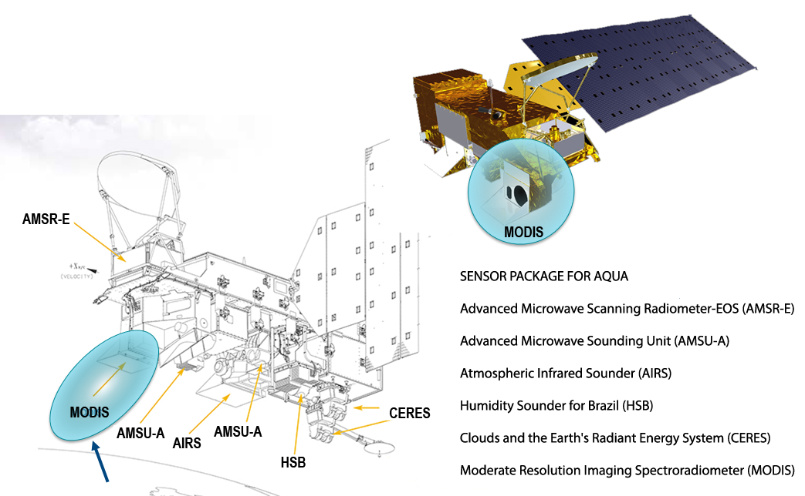
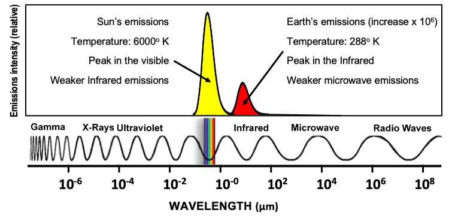
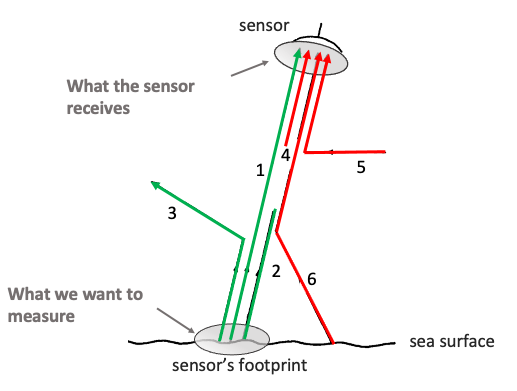

# Remote Sensing Basics

## Objectives 

Upon completion of this module, you will be familiar with the following vocabulary and concepts:

* Satellite vs sensor 
* Active vs passive sensor
* Electromagnetic radiation
* Geophysical variable/product
* Atmospheric windows
* Atmospheric correction
* Polar vs geostationary orbit
* Spatial, temporal resolution, swath width
* Wavelength band/channel
* Data levels \(L1, L2, L3, L4\)
* Temporal composites vs cloud cover
* Near-Real Time vs. Science Quality

## Advantages of satellite remote sensing 

There are many potential advantages for using satellite remote products, including:

* They provide measurements where surface-based measurements are not available,
* They augment existing measurements, and
* They provide global/near-global coverage.

## Satellite vs Sensor 

**Satellite**: A space-borne platform

**Sensor**: a space-borne platform holding one or more

* Some satellites are single-mission, carrying only one sensor:  e.g. the GeoEye/OrbImage satellite carries only the SeaWiFS sensor 
* Other satellites have multiple sensors on them:  e.g. MODIS is one of 6 sensors on the Aqua satellite. The Terra satellite also carries a MODIS sensor.

## What is measured by satellite sensors? 

Satellite sensors cannot directly measure populations of most fish, whales, turtles, monk seals, etc.

Instead, satellite data can provide information about oceanic parameters that influence marine resources: SST, Currents, Wind, Ocean color, Salinity

Satellite sensors measure electromagnetic radiation \(EMR\) that is emitted or reflected by the ocean \(and land\). Sensors target specific sets of wavelengths depending on their application After many corrections and calibrations, algorithms are used to calculate geophysical products \(SST, chlorophyll\_a concentration, wind speed, …\)

From Robinson, Discovering the Ocean from Space

Visible and IR \(Infrared\) radiation are typically presented with units of wavelength. Microwave radiation is typically presented with units of frequency. 

Each satellite application operates in specific part of the electromagnetic spectrum

## Sensor types \(active vs passive\) 

Passive sensors measure electromagnetic radiation that has a natural origin: 

* Solar radiation reflected or scattered from the Earth’s surface 
* Thermal radiation emitted from the Earth’s surface
* Passive sensors measure in the UV, visible, IR and microwave wavelengths/frequencies

Active sensors measure electromagnetic radiation generated by the satellite: 

* A pulse if electromagnetic radiation is directed to the Earth's surface
* The pulse interacts with the Earth's surface, and a part of the signal is reflected or scattered
* A portion of the reflected or scattered signal is detected by sensors on the satellite
* Examples of active sensors include altimeters, scatterometers, and radars.

## Electromagnetic radiation \(EMR\) 

Most solar energy comes to the earth as short wavelength electromagnetic radiation \(UV, visible light\) and is re-radiated \(emitted\) back to space as long wavelength electromagnetic radiation \(infrared, microwaves\)

​

## The influence of the atmosphere 

* All radiation is influenced by the atmosphere in various ways: The sun's radiation is scattered, reflected or absorbed by particles in the atmosphere as is the radiation reflected by the Earth’s surface.
* Satellites look at the earth surface through the atmosphere.

Credit: Jan Yoshioka, CI

​

* The influence of the atmosphere depends on the wavelength of EMR. The atmosphere is opaque to electromagnetic radiation at many wavelengths, due to absorption by atmospheric gases. There are only certain wavelengths through which radiation may be fully or partly transmitted.
* Remote sensing focuses on those transmissive ranges, the so-called atmospheric windows.

source: NASA

Where satellites can "see": atmospheric windows

In the **visible**, where the sun emits at the highest intensity, the atmospheric transmittance is high.

atmospheric window in the visible

At higher wavelengths, transmittance is reduced to narrow bands. This includes the optical windows in the **thermal infrared**, where the Earth's surface emits radiation.

optical windows in the thermal infrared

In the **microwaves**, the atmosphere is nearly transmissive, but the sun and earth's radiation are weak \(need large antennas to collect enough radiation\)

microwave range

Wavelengths shorter than the **ultraviolet** are nearly totally absorbed by the atmosphere and are therefore less relevant for remote sensing.

UV range

## Atmospheric pathways 

The sensor sees field of view or footprint on the Earth's surface. Ideally, we want the sensor to measure the electromagnetic radiation at the surface from within the footprint. However, processes occurring within the atmosphere alter the electromagnetic radiation reaching the sensor. The figure below summarizes those processes. 

**Electromagnetic radiation emitted by the sea from within the sensor's footprint**

**Ray 1** - the useful signal: radiation leaving the ocean and measured by the sensor

**Ray 2** - the radiation that is absorbed by the atmosphere before reaching the sensor 

**Ray 3** - the radiation that is scattered by the atmosphere out of the sensor field of view 

**Electromagnetic radiation reaching the sensor from outside the footprint**

**Ray 4** - the energy emitted by the constituents of the atmosphere that reaches the sensor 

**Ray 5** - the energy reflected by scattering into the field of view of the sensor 

**Ray 6** - the energy from the sea surface but from outside the field of view

**Atmospheric corrections are applied to the signal received by the sensor to account for**   

* the loss of signal that was emitted with the footprint \(Rays 1 and 3\) and
* the introduction of stray electromagnetic radiation not originating from the sea within the footprint \(Rays 4, 5 and 6\).

Even at “window” wavelengths, atmospheric correction of the satellite data is necessary to derive accurate satellite data products.

## How is EMR measured by sensors? 

Satellite sensors measure the intensity of EMR at specific wavelengths using a telescope to focus the EMR onto a series of light detectors \(radiometers\).

The configuration of the light detectors and telescope varies between sensor types, but in the end, all sensors produce a set of equally spaced boxes/pixels \(i.e., a 2-D array of measured values\) where each individual box/pixel contains the value of the intensity of EMR \(Watts m-2\) for a specific wavelength from each location on earth covered by the satellite.

From Robinson, Discovering the Ocean from Space

The resulting 2-D array can be displayed as an image or it can be analyzed as a 2-D array of numbers

The size of the rectangular region on earth over which the instrument averages the EMR onto a single light detector is referred to as the instrument resolution. For example, 1-km resolution sensor averages EMR intensity over a 1-km by 1-km region on the earth \(at nadir, i.e. when the satellite is directly at the vertical\).

EMR intensity at a specific wavelength, over a region

Multispectral radiometers measure EMR intensity at a few discrete wavelength regions. Each wavelength region is defined by a central wavelength and a small range of wavelengths around it \(a bandwidth\)

The intensity of EMR at each wavelength region is stored separately in a stack of digital images. Each separate image is called a wavelength band or a wavelength channel.

Each band or channel can be referred to by its central wavelength value or by sequential numbering \(1, 2, 3, …\) of each band from shortest to longest wavelength

## Higher order products 

Several bands can be combined to produce higher order products.

Below is an example of making a true color image from the addition of separate R, G and B bands.

​

Intensity of the 8 Visible and Near-Infrared Bands from the SeaWiFS Sensor for the East Coast of the US

True-Color Image Created from bands 2, 5, and 6

Final Color Image = C1\*band2 + C2\*band5 + C3\*band6

## Types of Applications of Satellite Data 

From Robinson, Discovering the Ocean from Space

## Resolution 

**Spatial resolution** is defined as the pixel size of an image representing the size of the surface area being measured on the ground and is determined by the sensors' instantaneous field of view \(IFOV\).

**Temporal resolution** is defined by the amount of time that passes between imagery collection periods.

**Swath width** of the satellite refers to the width of the area observed by the satellite. Satellites with larger swath widths will take less time to acquire global spatial coverage.

## Satellite orbits 

The two major types of satellite orbits are:

* **Polar orbiting**: a single polar orbiting satellite can view the entire earth once a day
* **Geostationary**: a single geostationary satellite can view a limited region of the earth, but can do so continuously throughout the day

### Polar Orbiting 

Credit: EUMETSAT

* Altitude: 700 -800km
* ~ 14 orbits a day
* Depending on the width of the swath, will cover almost the whole Earth in a day
* Global coverage
* High spatial resolution \(&lt; 1 km\)
* Low temporal resolution \(≥ 1 day\)

24h of chlorophyll-a data from the VIIRS instrument onboard the polar-orbiting NOAA-20 satellite

### Geostationary orbit 

Credit: Omega Open Course

Credit: [http://rammb-slider.cira.colostate.edu](http://rammb-slider.cira.colostate.edu/)​

Example: weather satellites. coverage of GOES-West \(US\), GOES-East \(US\), MeteoSat x2 \(Europe\), Himawari \(Japan\). &gt;5 geostationary satellites are necessary to achieve global coverage

## A note on satellite names … 

NOAA assigns a letter to the satellite before it is launched and a number once it has achieved orbit.

For the geostationary constellation, before being launched, GOES satellites are designated by letters \(A, B, C, etc.\). Once a GOES satellite is launched successfully, it is redesignated with a number \(1, 2, 3, etc.\). GOES-R, the first in NOAA's GOES-R series of satellites, was designated GOES-16 when it reached geostationary orbit. GOES-S became GOES-17.

Same for the polar-orbiting constellation: ITOS-A became NOAA-1. JPSS-1 was designated NOAA-20 when it reached its orbit.

GOES-A to GOES-F became GOES-1 to GOES-6.

Because GOES-G was a launch failure, it never received a number. GOES-H to GOES-R became GOES-7 to GOES-16 \(skipping GOES-Q, which was not built\).

The switch from pre-launch to on-orbit names allows to keep the name series intact for the on-orbit constellations.

## Levels of Data 

* Level 0: Raw data received from satellite, in standard binary form
* Level 1: Unprocessed data in sensor’s geographic coordinates, containing calibration information
* Level 2: Derived geophysical variables atmospherically corrected and geolocated, but presented in sensor’s geographic coordinates \(granules\). Also sometimes referred to as “along-track” data.•

Most useful for fisheries research:

* Level 3: Derived geophysical variables mapped on uniform space-time grid scales. Spatial and temporal composites.
* Level 4: Model output or results from analyses of lower-level data \(e.g., variables derived from multiple measurements, like primary productivity\), or interpolation to provide cloud-free product

From Robinson, Discovering the Ocean from Space

### Levels of Data: L0 -&gt; L3 examples 

From Chassot et al. 2011

### Level-2 vs. Level-3 data 

The sensor views the earth in a swath of individual scan lines as the satellite is moving

View is “distorted”, pixels geolocated along scan line

Pixels resampled to regular grid \(lat/lon\)

### Additional types of Level 3 

* Level 3C: Level 3 Collated : Data from different time periods from the same sensor are collated together to create a more complete image. For example, GOES-16 collects data every 15 mins, a daily L3C product would collate all data from one day. This helps with cloud cover.
* Level 3S: Level 3 Super-collated: Data from various sensors are collated together. For example, data from geostationary and polar-orbiting sensors to take advantage of the strengths of both \(higher resolution vs less impact from clouds\).

### Level-3 data – Temporal composites 

GOES West Imager – SST – 1 hour, 09/15/2018

GOES West Imager – SST – 1 day, 09/15/2018

GOES West Imager – SST – 1 week, 09/12/2018 – 09/18/2018

GOES West Imager – SST – 1 month, 09/01/2018 - 09/30/2018

### Level-3 vs. Level-4 data: Puerto Rico SST 

From Irina Gladkova, NOAA/NESDIS

### Levels of Data: L3 -&gt; L4 examples 

From Chassot et al. 2011

## Near Real Time vs Science Quality 

For some purposes, data is needed in near-real time \(NRT\), i.e. as quickly after being measured as possible. For many datasets, it is possible to obtain yesterday’s data \(or from a few hours ago\).

However, the processing of NRT data is a little on the “quick & dirty” side, to ensure fast through-put. To look at trends over time, or for data used in publications, Science Quality data, which has been processed more carefully for more accuracy, might be more adequate.

Different agencies have different definitions of NRT vs. Science Quality \(or Climate Quality\) data. Some science quality data are available several days after NRT, others perhaps only when the entire mission data is reprocessed.

​

## References 

* Bruce Monger. Remote Sensing Training Program. Cornell University.
* Robinson, Discovering the Ocean from Space. Springer. 2010
* Chassot et al. 2011. Satellite remote sensing for an ecosystem approach to fisheries management. _ICES Journal of Marine Science_, Volume 68, Issue 4

​

​

​

​

​

​

​

​

​

