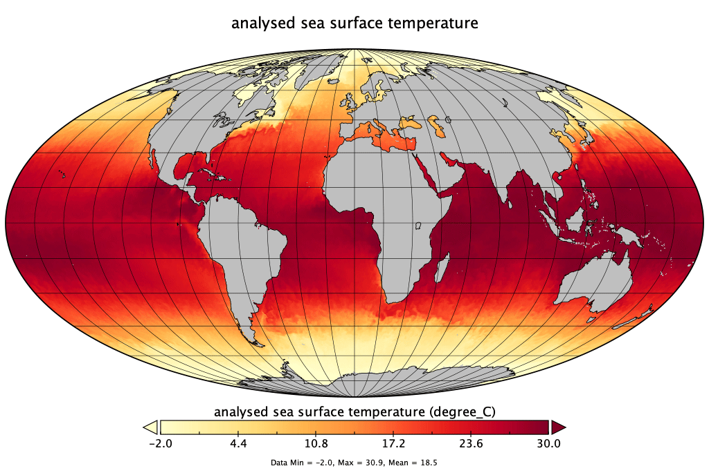

# Sea Surface Temperature

This lecture is also available as an audio-narrated [PowerPoint presentation](https://oceanwatch.pifsc.noaa.gov/files/hawaii2020/04-Sea_Surface_Temperature.pptx).

## Objectives 

Establish baseline vocabulary/concepts:

* What is SST?
* Which SST is measured from space?
* Infrared vs microwave measurements
* Measurements in the infrared
* Measurements in the microwaves
* GHRSST
* L4 Products
* A word of caution on L4 products

## What is Sea _Surface_ Temperature? 

SST is a difficult parameter to define exactly because the upper ocean \(~10 m\) has a complex and variable vertical temperature structure that is related to ocean turbulence and the air-sea fluxes of heat, moisture and momentum.

Sea surface temperature, when measured from space, represents temperature at a depth that is related to the frequency of the satellite instrument. For example, infrared instruments measure a depth of about 20 micrometers, while microwave radiometers measure a depth of a few millimeters.

## SST & surface processes 

From Martin 2010

## SST definitions 

From www.ghrsst.org

* The **skin temperature** is the temperature measured by an infrared radiometer typically operating at wavelengths 3.7-12 µm.
* For practical purposes, **SSTsubskin** can be well approximated by the measurement of temperature by a microwave radiometer operating in the 6-11 GHz frequency range
* SSTskin and SSTsubskin measurements are subject to a large potential diurnal cycle -&gt; night-time “SST” more stable
* The **foundation SST** is the temperature free of diurnal temperature variability. Only in-situ contact thermometry is able to measure SSTfnd and analysis procedures must be used to estimate the SSTfnd from satellite retrievals of SSTskin and SSTsubskin taken at other times of the day.

## Foundation SST 

From www.ghrsst.org

## Infrared vs. microwave measurements 

* **Infra-red instruments**: measure… SSTskin, at a high spatial resolution, but the surface is obscured by clouds.
* **Microwave instruments**: measure… an approximation to the SSTsubskin, through clouds and thus have fuller coverage, but at a reduced spatial resolution and only beyond 50-100km from land.

Products blended from multiple satellites or multiple passes of the same satellite \(L3C, L3S, L4\) use different methods to combine the observations from several sensors and to preserve the resolution or gradients in SST.

## SST measurements 

From Donlon et al, 2007

## Measurements of SST in the infrared  

From Minnett 2001.

There is a close relationship between emitted infrared radiation and SST. But the influence of the atmosphere needs to be removed to obtain accurate measurements. SST has been measured accurately in the infrared since 1981

#### Plank’s law for a blackbody emitter 

From Robinson 2004

The thermal radiation emitted at a particular wavelength from a warm object depends on its temperature. If the earth's surface is regarded as a **blackbody** emitter, its apparent temperature \(known as the **brightness temperature**\) and its emitted radiation are related by Planck's law.

#### Reminder: Atmospheric windows 

At higher wavelengths, transmittance is reduced to narrow bands. This includes the optical windows in the thermal infrared, where the Earth's surface emits radiation.

For a surface at a brightness temperature around 20ºC, **the spectral radiance peaks at a wavelength around 10 µm.** The peak of the Planck function for temperatures typical of the sea surface is close to the infrared atmospheric window, which is therefore well suited to SST measurement.

#### Reminder: Electromagnetic radiation \(EMR\) 

Credit: Jan Yoshioka

#### **The Atmosphere Attenuates the Signal**:  

As the electromagnetic radiation propagates through the atmosphere, some of it is absorbed and scattered out of the field of view of the radiometer, thereby attenuating the original signal.

From NASA

Earth viewed through the atmosphere is not quite a blackbody -&gt; atmospheric correction needed

#### **Clouds = Complete Attenuation of infrared radiation**:  

If the attenuation is sufficiently strong, none of the radiation from the sea reaches the height of the satellite, which is the case when clouds are present in the field of view of infrared radiometers.

Global cloudiness

#### Temperature Deficit:  

Even in clear-sky conditions, a significant fraction of the sea surface emission is absorbed in the infrared windows. This energy is re-emitted, but at a temperature characteristic of that height in the atmosphere. Consequently the brightness temperatures measured through the clear atmosphere by a spacecraft radiometer are **cooler** than would be measured by a similar device just above the surface. This atmospheric effect, known as the **temperature deficit**, must be corrected accurately if the derived sea surface temperatures are to be used quantitatively.

#### Water Vapor Complicates Things:  

In the 10-12µm spectral interval, water vapor is responsible for most of the temperature deficit, and is **variable both in space and time**. Other gases that contribute to the temperature deficit are quite **well mixed** throughout the atmosphere, and therefore inflict a relatively constant temperature deficit that is simple to correct.

Water vapor distribution

From Tynan, UCSD

The variability of water vapor requires an atmospheric correction algorithm based on the information contained in the measurements themselves.

This is achieved by making measurements at different wavelengths in the atmospheric windows where the water vapor attenuation is different. Assuming that the difference in the brightness temperatures measured at two wavelengths, i and j, is related to the temperature deficit in one of them, the atmospheric correction algorithm can be formulated: SST − Ti = f\(Ti − Tj\) where Ti, Tj are the brightness temperatures at wavelengths i, j.

Further, as an approximation, the Planck’s function can be linearized, so the algorithm can be expressed in the very simple form: SST = ao + ai _Ti + aj_ Tj where are ao, ai, and aj are coefficients and Ti and Tj are commonly measured at around 11 and 12 mm.

The coefficients are obtained by comparing coincident satellite and in situ measurements, mainly from buoys, or from simulated satellite measurements derived by modeling the propagation of the infrared radiation from the sea surface through a representative set of atmospheric profiles.

Nowadays, more complex algorithms are used to improve accuracy.

The atmospheric correction algorithms **work effectively only in the clear atmosphere**. The presence of clouds contaminates the measurement so they must be identified and removed from the SST retrieval process.

From Robinson 2004

#### SST observations in the Infrared to date 

A lot of concurrent observations from different sensors, which can be combined.

## Measurements of SST in the microwaves 

From Pearson et al, 2018. Measured accurately in the tropics since 1999 \(TRMM\). Measured accurately globally since 2002 \(AMSR-E\)

​

#### Reminder: Atmospheric windows 

**Low Intensity Signal**: The intensity of microwave radiation at the top of the atmosphere is low, but we can compensate with large \(~m\) antennae for microwave instruments.

**Diffraction Limits Spatial Resolution**: The longer wavelengths give rise to diffraction effects that limit the spatial resolution of microwave instruments to 25-50 km, limiting the precision with which thermal ocean fronts can be located in microwave imagery.

**The coast Contaminates the Ocean Signal**: The microwave emissivity of land and ice is significantly higher than the ocean. With contemporary instruments, this leads to contamination of the ocean microwave signal close to the coasts and ice edges and prevents accurate SST retrievals in these areas.

**Goes Through Clouds**: A significant advantage of using microwave measurements when attempting to achieve global coverage of SST is that microwaves can penetrate non-precipitating clouds, so they can observe the surface signal under cloudy conditions where infrared instruments cannot. This is useful, in particular, in persistently cloudy regions such as winter high-latitudes.

#### SST observations in the microwaves to date 

Currently only on polar-orbiting satellites.

From Donlon et al, 2007.

The GODAE High-Resolution SST pilot project was launched in 2002

Motivation: if SST observations are to improve weather and climate model performance, the minimum requirement is that they have an accuracy of better than 0.4 K, be made available in near-real time \(within 6h of observation\), and have fine spatial \(&lt;10km\) and temporal \(6-12 h\) resolution.

Goal: **Establish data format standards** making it possible to blend products accurately.

No single source by itself can meet the GHRSST specification, but it can be achieved by exploiting the synergy when several sources of SST data are combined and validated against in situ measurements:

* **Microwave & Infrared**: Microwave sensors can measure SST through clouds, although at a poorer spatial resolution than infrared radiometers.
* **Blend Geo-Stationary & Polar**: Instruments in geostationary orbits provide high temporal resolution but with only regional coverage, and those in polar orbits provide global coverage with repeat times from 12h to several days. Geostationary sensors complement other types with their rapid sampling frequency, giving more opportunity for cloud-free views, but only within the field of view limited by the satellite's horizon.

## Which SST dataset should be used? 

From Irina Gladkova.

#### User’s wish list:  

* High-resolution
* Satellite-based
* Gap-free

#### Can it be done? Sure: pick 2  

* High-res, satellite-based, ~~gap-free~~ -&gt;
  * L3C/S
* Satellite-based, gap-free, ~~High-res~~ -&gt;
  * L3S weekly or monthly at a spatial resolution lower than the sensor’s
* High-res, gap-free, ~~satellite-based~~ -&gt;
  * L4
  * Not guaranteed to be satellite-based, i.e. interpolation in the gaps, user does not know which pixels are satellite-based and which pixels are interpolated

## L4 SST products 

### Multiscale Ultra-high Resolution \(MUR\) SST 

* Created by NASA Jet Propulsion Laboratory
* June 1, 2002 – present
* Daily, global, cloud-free
  * Data from all available satellites \(infrared, microwave\) blended together
  * Data assimilated with global in-situ SST data to account for differences in the source data sets \(insitu data from NOAA’s iQuam database\)
  * New data available on a daily basis \(NRT & science quality\)
* 1 km spatial resolution
* Estimate of nighttime foundation SST - must consider diurnal effect

### Geo-Polar Blended SST 

* Created by NOAA Satellite Service, Satellite Applications & Research
* 2002 – present
* Data from infrared polar & geostationary satellites, blended together
  * Optimal interpolation assimilation balances detail preservation & noise reduction
  * New data available on a daily basis \(previous day\)
* 5km spatial resolution
* Estimate of nighttime SST - must consider diurnal effect

### Is gap-free more important than satellite-based? 

From Irina Gladkova.

Aleutian Island, June 7, 2018

### ~ High resolution in L4 products 

Monterey Bay, June 12, 2018

## SST Quality Monitor \(SQUAM\) 

NOAA developed a tool to compare different products with each other and with in-situ data: [https://www.star.nesdis.noaa.gov/sod/sst/squam/index.php](https://www.star.nesdis.noaa.gov/sod/sst/squam/index.php) ​

## L4 vs. L3C/S 

From Irina Gladkova.

L4 products are fundamentally different from L2/3’s, in at least two respects:

* They degrade \(smooth\) the native sensor resolution \(even where satellite SSTs are present\)
* They do not provide identification of which pixels have been filled in/ modeled.

Currently users face a dilemma to either:

* learn how to deal with huge \(and ever growing\) volumes of L2/3 data,
* or use an L4 product, without knowing what data come from real observations \(~30% globally\) and how much they were smoothed, versus \(~70% globally\) estimated/interpolated and/or from climatology with unknown quality.

From Irina Gladkova.

* JPSS funded the “SST fusion” project, aimed at “one good sensor-agnostic SST”, with best accuracy, coverage, and feature resolution
* The goal is to initially focus on super-collation of two VIIRSs in several Coast/Polar Watch regions, and creating regional L3S’s
* Eventually, we will consider including all available sensors into an L3S product & extend to global domain
* There is currently no global fused SST product that contains satellite data from available polar platforms without modeled values
* There are a few agencies \(e.g., the Australian Bureau of Meteorology, BoM\) which generate multi-sensor super-collated L3S SST products, for several regions of their interest

​

## References 

* Martin. An introduction to ocean remote sensing. Cambridge. 2010
* * Donlon et al 2007. The Global Ocean Data Assimilation Experiment High-resolution Sea Surface Temperature Pilot Project. BAMS. [https://doi.org/10.1175/BAMS-88-8-1197](https://doi.org/10.1175/BAMS-88-8-1197)​
* Robinson. Discovering the ocean from space. Springer. 2010.
* Minnett, 2001. Satellite Remote Sensing of Sea Surface Temperatures. Encyclopedia of Ocean Sciences \(Second Edition\). Elsevier.
* Pearson et al, 2018. The Role of Advanced Microwave Scanning Radiometer 2 Channels within an Optimal Estimation Scheme for Sea Surface Temperature. Remote Sens. **2018**, 10\(1\)
* ​

​

​

​

​

​

