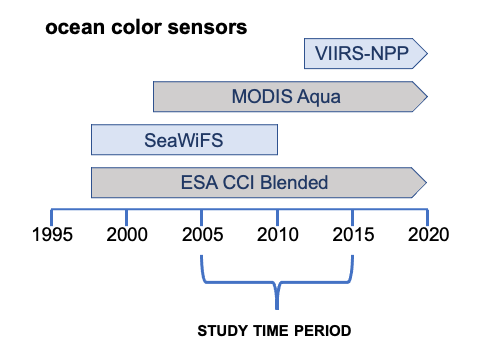

# What Dataset to Choose?

## Objectives 

In this module we will discuss how to select the best dataset for your application. Upon completion of this module, you will be be able to factor in the impacts of the following dataset characteristics on your daaset selections.  

* Temporal coverage
* Geographical coverage
* Spatial resolution
* Temporal resolution
* Latency / Quality
* Missing data

## Balance the Needs of Your Project

There is no perfect dataset that will work for every project. Each project has a unique set of requirements for ocean satellite data. Each dataset has characteristics that may be pros or cons for your project. The trick to find the datasets that strike a balance between the needs of your project and the properties of the available datasets. 

Below are listed some important dataset characteristics that should be evaluated when selecting datasets for you project. Each characteristic will be discussed in detail below.  

## Does the dataset cover the time of your study?

Satellites and sensors have a limited lifespan. The temporal cover describes the time period over which usable data from a sensor was collected and made available. 

The temporal coverage for three different ocean color sensors are pictured below. If your project required  chlorophyll data from the years 2005 through 2015, as pictured for study time period, then neither SeaWiFS or VIIRS alone could provide all the data you required. You would likely favor using data from MODIS-Aqua, which is available for the entire time period. 

Alternatively, you could use one of the blended datasets, where data from many ocean color missions have been merged for you. One example is the European Space Agency’s Climate Change Initiative Ocean color dataset \(ESA CCI Blended\). The dataset merges data from the SeaWiFS, MERIS, MODIS-Aqua, and VIIRS missions to create a blended dataset extending from 1997 to the present.

## Does the dataset cover your area of interest?

Spatial coverage, or the area of Earth’s surface over which data is collected, is not the same for all datasets. Many CoastWatch datasets have global coverage, but some may have only regional coverage.  Non-global coverage may be because the sensor has a limited spatial coverage or the result of splitting the global files into regional sectors to reduce file size. 

The NOAA GeoPolar dataset merges data from many polar-orbiting and geostationary satellites to produce daily global coverage.  If your study site is off the coast of Washington State, this dataset would provide the spatial coverage you need. 

The GOES-16 geostationary satellite, which carries the Advanced Baseline Imager \(ABI\)​ sensor, has a footprint on the Earth that runs from 52°N to 52°S latitude and covers South American and eastern US waters, with some coverage in the Pacific.

## How big can the pixels be?

Spatial resolution is the linear dimension on the ground represented by each pixel. Spatial resolution varies may among datasets. For example, the older GOES SST datasets have a 4km spatial resolution, whereas VIIRS high resolution datasets have a 750m resolution. On the map looks, the GOES data on the left looks blocky compared to the VIIRS map on the right, which has a spatial resolution of 750 m per side for a pixel. 

For work on the scale of the whole Central California coast, 4 km GOES data might have a high enough resolution for your needs. In addition, using a lower resolution dataset will make downloading and processing times for the data much faster. However, if you are interested in the feature visible in the circle on the VIIRS image, then the 4 km resolution data would not meet your needs.

What if your project examines a much smaller area? Let’s zoom in on a smaller area of interest within San Francisco Bay \(see the figure below\). The GOES sensor data gives, at most, 4 pixels going across the bay and about 20 pixels total within the entire bay. The GOES coverage probably does not well represent the temperature of the bay or show temperature features well. 

The VIIRS sensors has about 28 times more pixels for the entire bay than does GOES-West. The higher spatial resolution better represents the temperatures within the bay and allows the detection of surface temperature features.

Finer spatial resolution provides more details, but the amount of data that needs to be downloaded is larger.

## Temporal resolution: How often do you need a measurement?

How often a dataset has new measurement at the same location depends on swath width of the sensors, whether the satellite is polar orbiting or geostationary, and if data from several sensors are blended together in a dataset.

Temporal resolution helps you address the question of how often you need a measurement for your project. If you are examining trends over the last 30 years, a monthly measurement is probably sufficient for your needs. However, if you are studying events in a dynamic coastal region, there may be a requirement for weekly, daily, or even hourly measurements. 

On the left is the coverage for the ASCAT polar orbiting sensor for 3 successive days. ASCAT is an active microwave sensor in a polar orbit with a 500 m swath width. For the location west of Mexico indicated by the white dot on the figure below, you would get a wind measurement every 3 days.

If you require data more often, you would need to select a different dataset. For example, the Cross-Calibrated Multi-Platform \(CCMP\) dataset blends data from many data sources, including active and passive sensors, to make a global dataset with measurements as often as every 6 hours. The maps on the right \(above\) show daily wind maps from the CCMP dataset that provide a measurement each day of the 3-day period at the location indicated by the white dot.

## Latency/quality: How fast do you need the data and at what quality?

Typically, there is a tradeoff between getting data very soon after it’s been collected and getting the highest quality data. For near real-time data, the data provider is making the data available as quickly as possible, often within a day or even an hour of acquisition. To do this, the strictest quality control for the data cannot be applied. The data in NRT datasets are not bad. More likely, some pixels with questionable data may not have been removed from the dataset. In contrast, science quality data is released after a delay to allow for strict quality controls to be applied.

The figure below shows how cloud cover may impact datasets where science quality and near real-time quality control is applied to chlorophyll data from the same VIIRS source data. The science quality version is on the left and near real-time version is on the right. For the NRT image on the right, the inset zooms in on an area where clouds block the ocean color signal, creating gaps in the data. 

However, it turns out that clouds can have more subtle impacts on the ocean color signal, which can degrade the quality of pixels near the pixels blocked by clouds in the near real-time processing. The less rigorous quality control that is applied to near real-time data can miss identification of these degraded pixels. Now look at the image on the left, which was made from science quality data.  The inset zooms in on the same cloudy area. You can see that the data gaps are larger. The science quality data were delayed by about 2 weeks to allow time for more rigorous quality control. The additional degraded pixels were identified and removed from the dataset during this quality control process, resulting in the larger data gaps.  

### Case Study for use of near real-time and science quality

The next few slides help illustrate how both science quality and near real-time data make important contributions to ocean management and research. If a group is developing a model to predict the distribution of harmful algal blooms, they might develop a habitat model that uses environmental data like chlorophyll concentration to define conditions under which harmful algal blooms had formed in the past. They would want the best quality data available to create the model. In other words, they would use the science quality data. Since this would be a retrospective analysis, the two-week delay for science quality data would not impact model development. 

On the other hand, when using the model to predict the distribution of harmful algal blooms a few days into the future, the group couldn’t use science quality data that is two-weeks old. Doing so would reduce forecasting ability. Instead, they would use the most up-to-date data available, the near real-time data. The group would need to accept the potential increased error in order to obtain the data quickly for prediction purposes. 

## Missing data: How much can your project tolerate?

There can be many reasons for missing data, but for this example let’s consider two: cloud coverage and coastal masking. On the figure below, two study sites are marked for locations in a relatively cloudy region off the Washington State Coast. For location 1, you might consider using the microwave data to minimize missing data due to clouds. Microwave imagery can see through many cloud conditions. 

Location 2 is close to the cost, in a region where the ocean microwave signal is masked out because it is contaminated by the microwave signal coming off of the land. Even though infrared data is likely to be periodically missing because it is blocked by cloudy conditions, you would need to opt for the infrared dataset \(assuming that these two datasets are your only options\)

## Case Study: Managing missing data from clouds

This case study takes a closer look at strategies for overcoming data gaps due to clouds in SST imagery.  We will start with a map using SST infrared data that has a significant amount of missing data due to cloud cover. 

### **Temporal averaging** 

One strategy to reduce data gaps is to take the average values over several days. For example, for a 3-day composite data in each pixel contains a value that is an average of the day of interest, plus the day before and the data after. As more days are added to the averages \(see figure below\), data gaps are reduced. However, the data are more smoothed over more days. Notice how the finer structure visible within the circle in the 3-day image is less distinct in the weekly and monthly images.

### Switch to microwave imagery

Microwave imagery can see through clouds, so daily microwave images will often reduce data gaps. A potential drawback is that spatial resolution can be less. Spatial resolution from microwave sensors is about 25 km, compared to infrared imagery with spatial resolutions typically from 7.40m to 4 km. In addition, microwave imagery has data masked out within approximately 50 km of shore. 

### **Switch to geostationary imagery**

Sensors on geostationary satellites look at the same location on earth and capture an image every 30-60 minutes. The idea is that clouds will move around during the course of a day, increasing the chance of capture data for each pixel when it is cloud-free. Using daily geostationary imagery will often reduce data gaps, but spatial resolution can be less. Sensors on polar-orbiting infrared satellites can have sub-kilometer spatial resolution, whereas resolutions from infrared sensors on geostationary satellites typically range from 2-4 kilometers.

