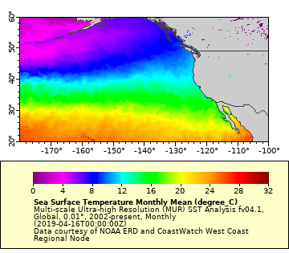
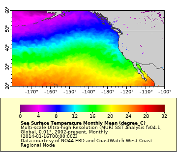
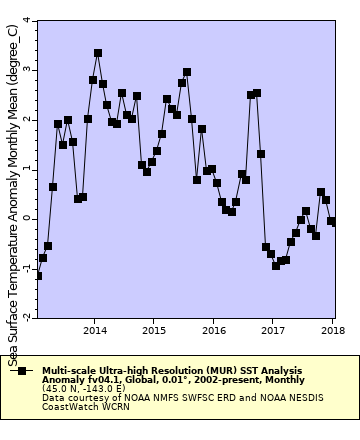
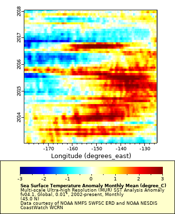

# Timeseries and Hovmöller diagrams

## The 2014 marine heatwave

This exercise examines the marine heatwave that was observed in the North Pacific Ocean off the west coast of North America, also know as "**The Blob"**. It was first detected in late 2013 and continued to spread throughout 2014 to 2016.

The exercise demonstrates the following ERDDAP features \* mapping data in an area of interest

* creating a time series at a specified latitude and longitude coordinate
* creating a Hovmöller diagram

## Visualize the marine heatwave with SST

The marine heatwave was strong in the northern Pacific. Let’s compare SST in the area after the marine heatwave subsided and during the marine heatwave.

**Selecting the SST dataset**  
 For this demonstration, use the Multi-scale Ultra-high Resolution sea surface temperature \(MUR SST\) dataset. MUR is a dataset containing data from many sensors, to increase the number of pixels that containing data. Where gaps in the measurements do exist, interpolated data fill the gaps.

* Enter the following URL into your browser: `https://coastwatch.pfeg.noaa.gov/erddap/` or Google `"ERDDAP west coast"`. 
* In the search box type `"MUR SST"` and click the `"Search"` button.

Several MUR datasets show up in the search results. Since we will be visualizing data over many years, select the version of the dataset that contains monthly averages.

* Locate the dataset with the title `"Multi-scale Ultra-high Resolution (MUR) SST Analysis fv04.1, Global, 0.01°, 2002-present, Monthly"`. Alternately, you can add the dataset ID `"jplMURSST41mday"` to the search box to narrow your search. 
* Click on `"graph"` in the `"Make A Graph"` column to the left of the dataset.

**Zoom the map in on the northern Pacific**

* Change the minimum and maximum latitude and longitude values using the latitude and longitude widgets:
  * Latitudes: `20, 60`
  * Longitudes: `-179, -100`

#### **Create a map for a time when** marine heatwave **conditions were not present \(time after 2016\)**

* Change time widget to select January 2017 \(2017-01-16T00:00:00Z\)
* Make sure that the `"color"` drop down menu has `"sst"` selected
* Click `"Redraw the Graph"` 
* Now go to the `"File Type:"' drop down menu and select`“.largePng”\`
* Go to the `"view the URL:"` box and copy the URL. &gt; `https://coastwatch.pfeg.noaa.gov/erddap/griddap/jplMURSST41mday.png?sst[(2017-01-16T00:00:00Z)][(20.0):(60.0)][(-179.99):(-100.0)]&.draw=surface&.vars=longitude|latitude|sst&.colorBar=|||||&.bgColor=0xffccccff` 
* Open a new tab in your browser and paste the URL to view the image

#### **Create a map for a time during the** marine heatwave

Use one of the following methods:

1. Modify the date of a data request with the URL 

* Copy the URL from above and paste it into a new tab on your browser
* Change the January 2017 date \(2017-01-16T00:00:00Z\) to January 2014 \(2014-01-16T00:00:00Z\) &gt; `https://coastwatch.pfeg.noaa.gov/erddap/griddap/jplMURSST41mday.png?sst[(2014-01-16T00:00:00Z)][(20.0):(60.0)][(-179.99):(-100.0)]&.draw=surface&.vars=longitude|latitude|sst&.colorBar=|||||&.bgColor=0xffccccff`

2. Use the ERDDAP GUI

* Return to the MUR `Make A Graph` page
* Change time widget to select January 2014 \(2014-01-16T00:00:00Z\).
* Make sure that the `"color"` drop down menu has `"sst"` selected.
* Click `"Redraw the Graph"`. 
* Now go to the `"File Type:"' drop down menu and select`“.largePng”\`
* Go to the `"view the URL:"` box and copy the URL.
* Open a new tab in your browser and paste the URL to view the image.

Now click back and forth between the two tabs to compare marine heatwave to non-marine heatwave conditions. Do you see the marine heatwave? There is a pretty subtle distinction between images on the two tabs. During marine heatwave conditions, the isotherms should be shifted northward in the northern Pacific.

##  Visualize the marine heatwave with an SST Anomaly

A better way to graphically the marine heatwave is by looking at the **temperature anomaly**. **Temperature anomaly** datasets show the deviation of SST from a long-term mean \(climatology\), i.e. how is the SST different from the average value.

#### **Selecting the SST anomaly dataset** 

For this demonstration, use the Multi-scale Ultra-high Resolution sea surface temperature anomaly \(MUR Anom\) monthly dataset \(ERDDAP ID = jplMURSST41anommday\).

* In your browser, go back to the ERDDAP search page: `https://coastwatch.pfeg.noaa.gov/erddap/`.
* In the search box type “jplMURSST41anommday” and click the `"Search"` button.
* Only one dataset should show up. Click on `"graph"` in the `"Make A Graph"` column to the left of the dataset.

#### Mapping the marine heatwave

* Change the minimum and maximum latitude and longitude values using the latitude and longitude widgets:
  * Latitudes: `20, 60`
  * Longitudes: `-179, -100` 
* Change time widget to select January 2014 \(2014-01-16T00:00:00Z\). 
* Make sure that the `"color"` drop down menu has `"anom"` selected. 
* Click `"Redraw the Graph"`. 
* Now go to the `"File Type:"' drop down menu and select`“.largePng”\` 
* Go to the `"view the URL:"` box and copy the URL. 
* Open a new tab in your browser and paste the URL to view the image.

Now the marine heatwave is clearly visible as an area of up to +3 degrees warmer than the long-term mean! Note how the color bar has changed. By default anomaly datasets have a color bar that differentiates between negative and positive values.

##  Creating a timeseries

#### How long did the marine heatwave last? 

To find out let’s make a time series of data from a point within the marine heatwave.

* In the **Graph Type** widget change from `surface` to `lines and markers` 
* In the time widget, enter a `Start` time of `2013-01-01`, which is before the marine heatwave started, and a `Stop` time of `2018-01-16T00:00:00Z`.

Pick latitude and longitude coordinates that are within the marine heatwave area. \* Enter `45` as the latitude \* Enter `-143` as the longitude \* Click the `"Redraw the Graph"` button

##  Creating a 2D timeseries \(Hovmöller\) plot

The time series plot shows the progression of the marine heatwave at a single latitude and longitude point. A better way to visualize the marine heatwave is to create a Hovmöller diagram \([https://en.wikipedia.org/wiki/Hovm%C3%B6ller\_diagram](https://en.wikipedia.org/wiki/Hovm%C3%B6ller_diagram)\), which is a two-dimensional timeseries. For this demonstration, we will plot along a longitude range, from `-179E` to `-125E`, at a latitude of `45N` over time.

* In the **Graph Type** widget change `lines and markers` back to `surface`
* In the **Y axis** widget change `latitude` to `time`
* Enter `2013-01-01` as the `Start` time
* Enter `2018-01-01` as the `Stop` time
* Enter `45` as the latitude
* Enter `-179` as the minimum longitude
* Enter `-125` as the maximum longitude
* Click the `"Redraw the Graph"` button

The plot shows that the marine heatwave moved east throughout 2014 and 2015, and then expanded across most of the eastern basin at the end of 2015.

##  Try this on your own

Create a Hovmöller diagram plotted against latitude rather than longitude?

