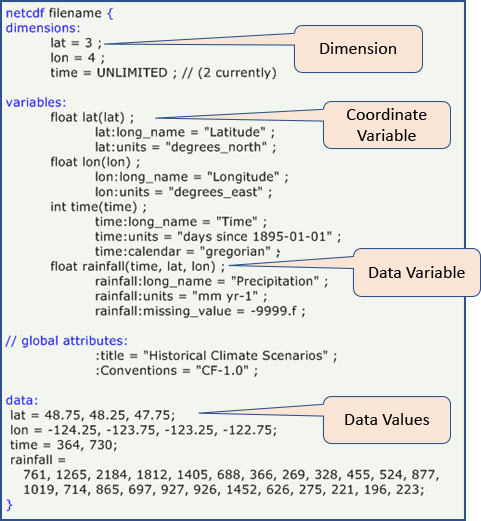
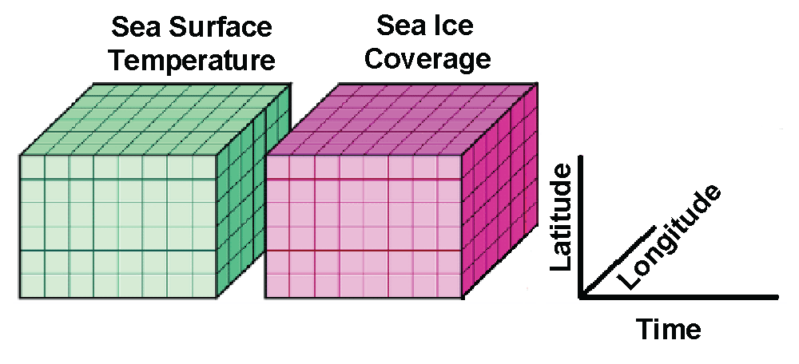
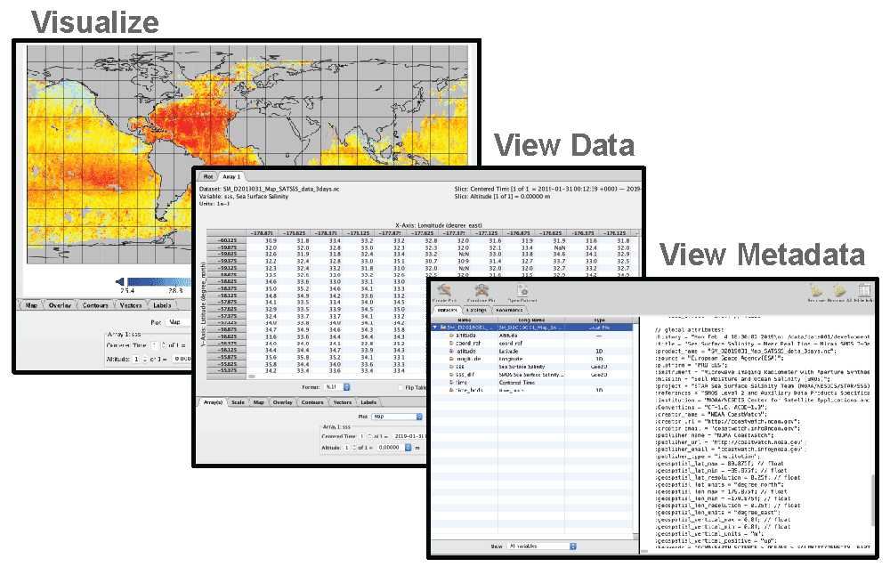

# NetCDF and Panoply tutorial

## NetCDF 

N**etCDF \(Network Common Data Form\)** is a file format for storing multidimensional scientific data \(variables\), including satellite observations of variable we wll use in the course such as sea surface temperature, salinity, chlorophyll concentration, and wind speed. Many organizations and scientific groups in different countries have adopted netCDF as a standard way to represent some forms of scientific data.

The NetCDF format has many advantages, the most important of which is that it is **self-describing**, meaning that software packages can directly read the data and determine its structure, the variable names and essential metadata such as the units. This self-describing aspect of the netCDF file format means that the information needed to ensure accurate work \(reduce the incidence of errors\) is available within the data itself \(no need for additional files\). Secondly, it means that different analysis software, like Matlab, R, Python or ArcGIS \(among many others\), have utilities to read and work with NetCDF files. Thirdly, plotting software \(e.g. Ferret, **Panoply**, ncview\) can directly read the netCDF files for visualization.

## NASA Panoply 

NASA developed the Panoply viewer that allows users to view and visualize data held in NetCDF files. Some feature is the software include:

* Visualize data from netCDF and HDF files
* View the metadata
* View the data
* Display the data in many different map projections
* Download visualization as images
* Create animations
* Freeware

Panoply is available for download at: [https://www.giss.nasa.gov/tools/panoply/](https://www.giss.nasa.gov/tools/panoply/) and can be run on Windows, Mac and Linux computers. 

A set of "how to" instructions can be found to the following URL   
[https://www.giss.nasa.gov/tools/panoply/help/](https://www.giss.nasa.gov/tools/panoply/help/)  
Below are a few examples to try out to get you used to visualizing data with the Panoply Viewer.

## Example \#1. Make a map of global chlorophyll a concentration 

* Launch Panoply.
* When Panoply opens, it prompts you to open a file. Open the file you just downloaded.

Panoply interface

On the left side, Panoply lists the variables contained in the file \(longitude, latitude, chlorophyll concentration\).

On the right side, it displays the file’s metadata. You can scroll down to get more details. For example, in the global attributes, you will find the platform \(this is data from the Aqua satellite\), the instrument \(MODIS\), the processing version \(2018.0\), the time coverage \(2002 to 2018\). There is no time variable however, this is a cumulative mean over the time period. Notice you didn’t need to download any ancillary files to access all the metadata, it’s embedded in the one file you downloaded.

* Find the identifier\_product\_doi in the list of global attributes. Copy it in the doi field on this [website](http://dx.doi.org/). This should lead you here: [https://oceancolor.gsfc.nasa.gov/data/10.5067/AQUA/MODIS/L3M/CHL/2018/](https://oceancolor.gsfc.nasa.gov/data/10.5067/AQUA/MODIS/L3M/CHL/2018/) This page contains extra information about the data if you are interested in reading more about it. Metadata varies from file to file depending on how much information is provided by the person/institution who generated the file.
* Next, on the left side of the screen, double click on the chlor\_a variable. Keep the default settings and click Create. \(this will take a minute, it’s a big file\)

Panoply generated an image of the chlorophyll data contained in the file.

* Above the image, click on the “Array 1” submenu. This shows you all the values of chlorophyll concentration contained in the file for each longitude/latitude pixel.

We now need to adjust the color scale and tweak some of the image options. Note: There may be a lag between clicking or adjusting values, and results. It’s a big file.

* Below the image, click on the “scale” submenu.
  * Change the “Units” from “scalar” to “log10”.
  * Adjust the color scale to 0.02 to 2.0.
  * In “Color Table” you have many options of color palettes. I like the “MPL\_viridis.rgb” for chlorophyll concentration, but you can choose whichever one you prefer.
* Next click on the “Map” submenu and
  * change the map projection to “Mollweide Oblique”.
  * change “Center on: Lon.” to 180º.
  * change “Grid: style” to none if you want to remove the longitude/latitude grid.
* Click on the “Labels” submenu
  * uncheck the “Center footnote” box.
  * edit the Title to “AQUA MODIS Chlorophyll Concentration, 2002 – 2018”
* Finally, save the image to your computer \(File &gt; Save image\).

You can also go to: [https://www.giss.nasa.gov/tools/panoply/colorbars/](https://www.giss.nasa.gov/tools/panoply/colorbars/) to download additional color palettes. Download another palette for chlorophyll, open it in Panoply, then change the color palette for your image to this new one. Save the image to your computer.

## Example \#2. Make a map of global SST 

Download a file of global Sea Surface Temperature from the CoastWatch FTP server:

​[ftp://ftp.star.nesdis.noaa.gov/pub/socd2/coastwatch/sst\_blended/sst5km/night/ghrsst/2020/](ftp://ftp.star.nesdis.noaa.gov/pub/socd2/coastwatch/sst_blended/sst5km/night/ghrsst/2020/)​

Open it in Panoply. Scroll down the list of metadata. You can see it looks different from the metadata for the previous file.

This is a blended product. Identify the name of the instruments and satellites the data come from. How many satellites were used to create this gap-free SST dataset?

Following the same steps as above, create an image of the “analysed\_sst” variable with an appropriate color scale. \(You do not need to use a log scale for SST though\).

* Change the units to ºC or ºF.
* Click on “Fit to Data” to adjust the color scale or adjust the range of values manually.
* Adjust the title with the file’s date.
* Save to your computer.

## Example \#3. Zooming in on a region 

Close any graphics window.

* Double-click on “analysed\_sst” again and click ok.
* To zoom in on a region, type “Ctrl”. You will see that your cursor changes to a magnifying glass. While keeping the “Ctrl” key down, click and drag over a region of interest. This will generate a plot of SST for that region only.

## Files with multiple time steps 

Download chl-a data for several months using the following URL:

* Open it in Panoply This is monthly chlorophyll concentration data from the VIIRS instrument, on the Suomi-NPP satellite for the Hawaii region.
* Zoom in on the Hawaii region where there is data.
* Adjust the scale to a log scale and an appropriate range of values
* Click on the “Array\(s\)” tab. There you can select a specific time step. Scroll through the dates and save a plot.

## References: 

 [https://www.unidata.ucar.edu/software/netcdf/docs/netcdf\_introduction.html](https://www.unidata.ucar.edu/software/netcdf/docs/netcdf_introduction.html)

​[https://www.unidata.ucar.edu/software/netcdf/docs/faq.html\#whatisit](https://www.unidata.ucar.edu/software/netcdf/docs/faq.html#whatisit)​

​[https://www.giss.nasa.gov/tools/panoply/](https://www.giss.nasa.gov/tools/panoply/)

​[http://pro.arcgis.com/en/pro-app/help/data/multidimensional/a-quick-tour-of-netcdf-data.htm](http://pro.arcgis.com/en/pro-app/help/data/multidimensional/a-quick-tour-of-netcdf-data.htm)

​[https://www.nodc.noaa.gov/woce/woce\_v3/wocedata\_1/cmdac/primer/why.htm](https://www.nodc.noaa.gov/woce/woce_v3/wocedata_1/cmdac/primer/why.htm)

​[https://www.researchgate.net/publication/315950787\_xarray\_N-D\_labeled\_Arrays\_and\_Datasets\_in\_Python](https://www.researchgate.net/publication/315950787_xarray_N-D_labeled_Arrays_and_Datasets_in_Python)

​[https://xkcd.com/](https://xkcd.com/)​

​

​

​

​

​

