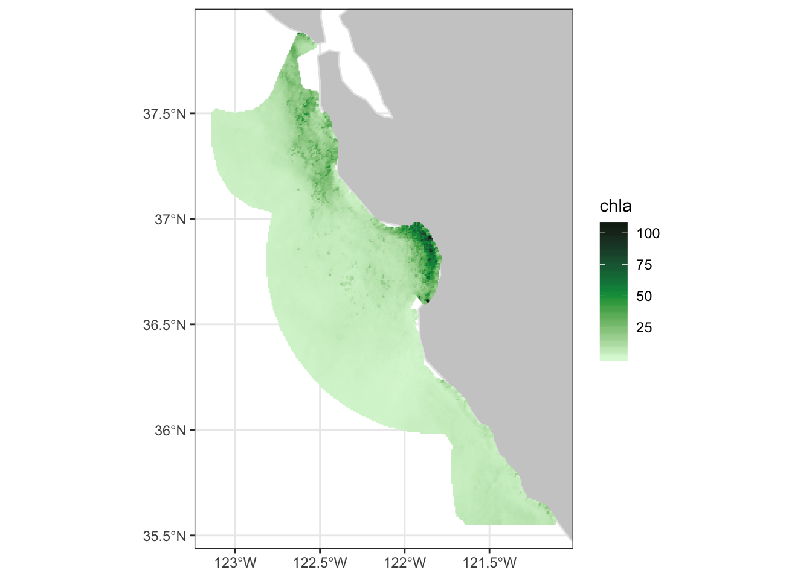
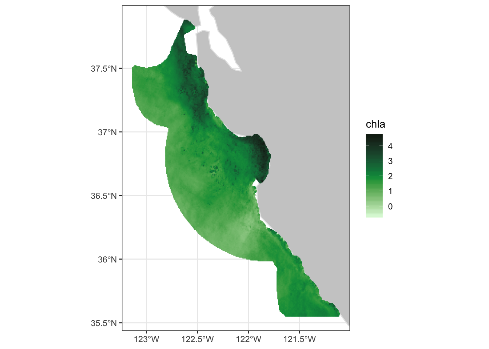

# Chapter 2 Extract data within a boundary

> notebook filename \| [02-sanctuary.Rmd](https://github.com/CoastWatch-WestCoast/r_code)

In this exercise, you will download data from within the boundaries of the Monterey Bay National Marine Sanctuary \(MBNMS\) and visualize the data in a map.

The exercise demonstrates the following skills:

* Using **rerddap** to retrieve information about a dataset from ERDDAP 
* Using the **rxtractogon** function to extract satellite data within an polygon over time 
* Mapping satellite data

##  Install packages and load libraries

```text
pkges = installed.packages()[,"Package"]
# Function to check if pkgs are installed, install missing pkgs, and load
pkgTest <- function(x)
{
  if (!require(x,character.only = TRUE))
  {
    install.packages(x,dep=TRUE,repos='http://cran.us.r-project.org')
    if(!require(x,character.only = TRUE)) stop(x, " :Package not found")
  }
}

# create list of required packages
list.of.packages <- c("ncdf4", "rerddap","plotdap", "parsedate", 
                      "sp", "ggplot2", "RColorBrewer", 
                      "reshape2", "maps", "mapdata", "jsonlite","rerddapXtracto")

# Run install and load function
for (pk in list.of.packages) {
  pkgTest(pk)
}

# create list of installed packages
pkges = installed.packages()[,"Package"]
```

##  Load sanctuary boundary coordinates

The **rerddapXtracto** package comes with the dataset **mbnms** which conatains the longitude and latitude values for the boundary of the Monterey Bay National Marine Sanctuary. These coordinates draw the the boundary of the sanctuary on a map, like tracing a dot-to-dot drawing. Take a quick look at the contents of this data variable.

```text
str(mbnms)
```

```text
## 'data.frame':    6666 obs. of  2 variables:
##  $ Longitude: num  -123 -123 -123 -123 -123 ...
##  $ Latitude : num  37.9 37.9 37.9 37.9 37.9 ...
```

Additional sanctuary boundaries may be obtained at   
[http://sanctuaries.noaa.gov/library/imast\_gis.html](http://sanctuaries.noaa.gov/library/imast_gis.html).

#### **The script below e**xtracts the longitude and latitude data into vector variables

```text
# Extract the longitude and latitude data into vector variables
xcoord <- mbnms$Longitude
ycoord <- mbnms$Latitude
```

##  Select the chlorophyll dataset

For this example we will use 750 m VIIRS monthly chlorophyll dataset \(ID erdVHNchlamday\)

**The script below:**

* Gathers information about the dataset \(metadata\) using **rerddap**
* Displays the information

```text
# Use rerddap to get dataset metadata 
# erdVHNchlamday is N. Pacific 750 m VIIRS chl
dataInfo <- rerddap::info('erdVHNchlamday') 

# Display the metadata 
dataInfo
```

```text
##  erdVHNchlamday 
##  Base URL: https://upwell.pfeg.noaa.gov/erddap/ 
##  Dimensions (range):  
##      time: (2015-03-16T00:00:00Z, 2019-09-16T00:00:00Z) 
##      altitude: (0.0, 0.0) 
##      latitude: (-0.10875, 89.77125) 
##      longitude: (-180.03375, -110.00625) 
##  Variables:  
##      chla: 
##          Units: mg m^-3
```

##  Set the options for rxtractogon

* Use the name of the chlorophyll parameter that was displayed above in dataInfo: **parameter &lt;- “chla”** 
* The metadata from dataInfo also shows you that this variable has a altitude coordinate that equals zero. Set the value of the time coordinate to zero: **zcoord &lt;- 0.** 
* The time variable passed to xtracogon must contain two elements, the start and endpoints of the desired time period.
  * This example makes use of the “last” option of ERDDAP to retrieve data from the most recent time step.
  * The “last’ option also accepts the”-" operator. To request the time step with the second most recent data use “last-1”.
  * In the script below the time variable \(tcoord\) is defined as **tcoord &lt;- c\(“last-1”, “last”\)**

##  Extract data and mask it using rxtractogon

* Set the arguments within the **rxtractogon** function using the dataset information \(dataInfo\), the longitude \(xcoord\) and latitude \(ycoord\) vectors from the CSV file, the time \(tcoord\) vector and altitude \(zcoord\) variable. 
* Then run **rxtractogon** to extract data from the “erdVHNchlamday” dataset and mask out data not falling within the MBNMS boundary.

```text
## Request the data
sanctchl <- rxtractogon (dataInfo, parameter=parameter, xcoord=xcoord, 
                         ycoord=ycoord, tcoord=tcoord, zcoord=zcoord)

```

* List the data

```text
## List the returned data
str(sanctchl)
```

```text
## List of 6
##  $ chla       : num [1:272, 1:311, 1:2] NA NA NA NA NA NA NA NA NA NA ...
##  $ datasetname: chr "erdVHNchlamday"
##  $ longitude  : num [1:272(1d)] -123 -123 -123 -123 -123 ...
##  $ latitude   : num [1:311(1d)] 35.6 35.6 35.6 35.6 35.6 ...
##  $ altitude   : num [1(1d)] 0
##  $ time       : POSIXlt[1:2], format: "2019-08-16" "2019-09-16"
##  - attr(*, "class")= chr [1:2] "list" "rxtracto3D"
```

The extracted data contains two time periods of chlorophyll data within the sanctuary boundaries.

## Select a time period

### Choose Time to Plot

The extracted data contains two time periods of chlorophyll data within the sanctuary boundaries. For this example we will show how to select just one time period from the options and map it, here we choose the second time stamp.

```text

sanctchl1 <- sanctchl
sanctchl1$chla <- sanctchl1$chla[, , 2]
sanctchl1$time <- sanctchl1$time[2]
```

###  Plot the data

* Use the plotBBox function in rerddapXtracto to quickly plot the data

```text
plotBBox(sanctchl1, plotColor = 'algae', maxpixels=100000)
```



### Apply a function to the data

Chlorophyll data is often plotted as log. We can apply a function to the plotting routine to convert the chlorophyll values to log. 

```text
myFunc <- function(x) log(x) 
plotBBox(sanctchl1, plotColor = 'chlorophyll',maxpixels=100000, myFunc=myFunc)
```



