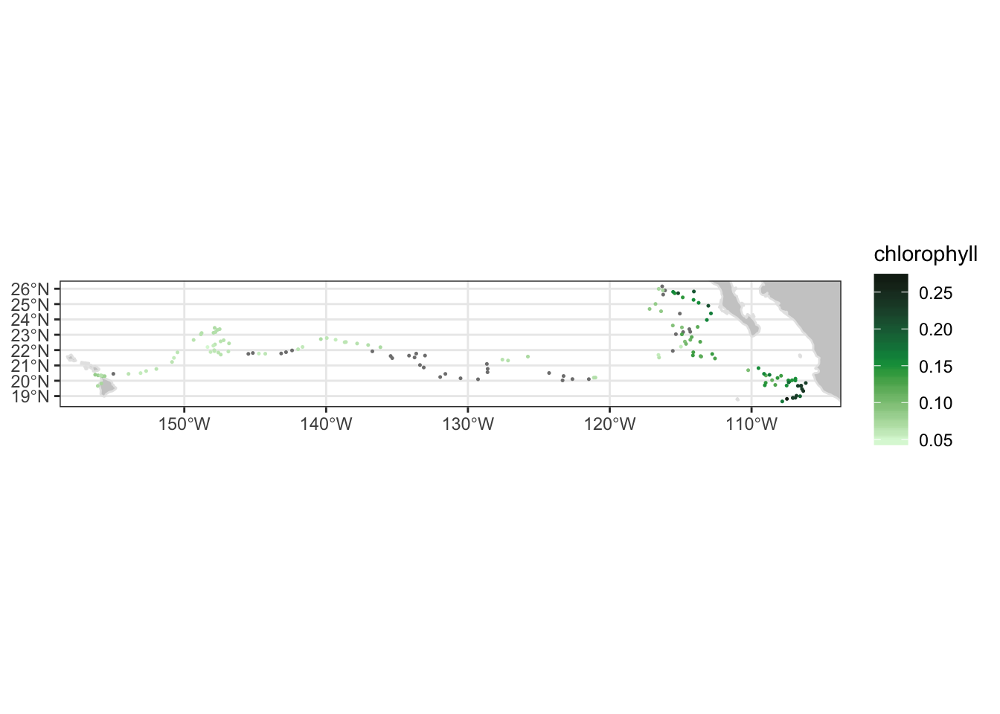
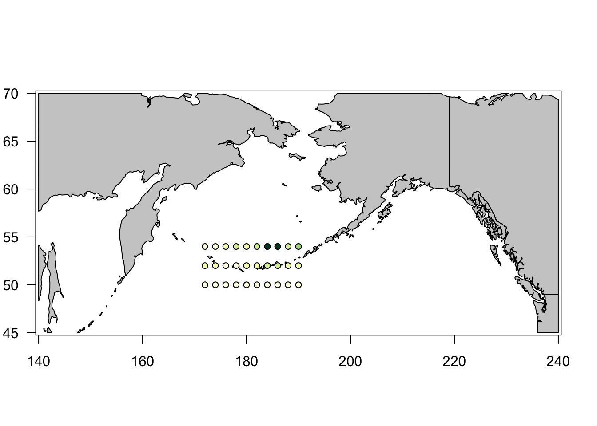
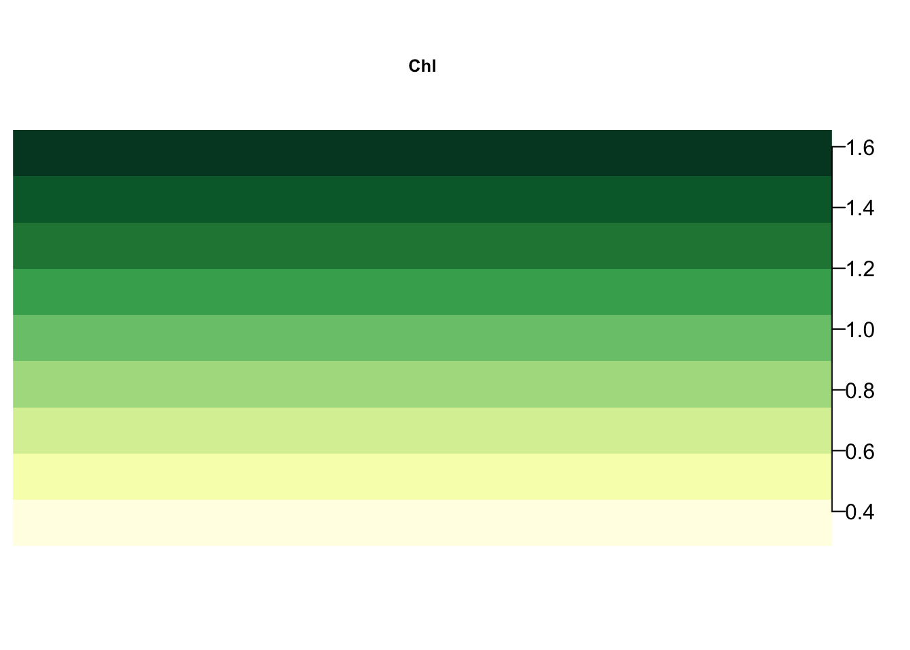
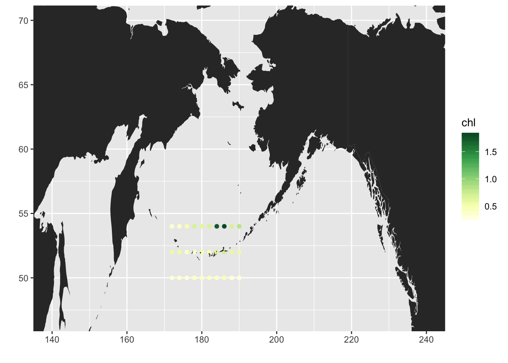

# Chapter 3 Matchups to ship or animal tracks

> notebook file \| [03-xyt\_matchup.Rmd](https://github.com/CoastWatch-WestCoast/r_code)

This exercise you will extract satellite data around a set of points defined by longitude, latitude, and time coordinates like that produced by an animal telemetry tag, and ship track, or a glider tract.

The exercise demonstrates the following techniques:

* Using the **rxtracto** function to extract satellite data along a track 
* Using **rerddap** to retrieve information about a dataset from ERDDAP 
* Using **plotTrack** to plot the satellite data onto a map as well as to make an animation
* Loading data from a tab separated file 
* Plotting the satellite data onto a map

This data is taken from the ERDDAP server at [http://coastwatch.pfeg.noaa.gov/erddap/](http://coastwatch.pfeg.noaa.gov/erddap/)

##  Install required packages and load libraries

```text
# Function to check if pkgs are installed, and install any missing pkgs

pkgTest <- function(x)
{
  if (!require(x,character.only = TRUE))
  {
    install.packages(x,dep=TRUE)
    if(!require(x,character.only = TRUE)) stop(x, " :Package not found")
  }
}

# create list of required packages
list.of.packages <- c("ncdf4", "rerddap","plotdap","rerddapXtracto","parsedate",
                      "graphics", "maps", "mapdata","RColorBrewer","ggplot2", "gifski",
                      "png")

# create list of installed packages
pkges = installed.packages()[,"Package"]

# Install and load all required pkgs
for (pk in list.of.packages) {
  pkgTest(pk)
}
```

##  Get XYZ coordinates

In this exercise we willuse in the XYZ coordinates that have been brought in from a file. Installation of the “rerddapXtracto” package comes with the “Marlintag38606” dataset which we will use for this exercise. It is the track of a tagged marlin in the Pacific Ocean \(courtesy of Dr. Mike Musyl of the Pelagic Research Group LLC\).

The “Marlintag38606” file has this structure:

```text
str(Marlintag38606)
```

```text
## 'data.frame':    152 obs. of  7 variables:
##  $ date  : Date, format: "2003-04-23" "2003-04-24" ...
##  $ lon   : num  204 204 204 204 204 ...
##  $ lat   : num  19.7 19.8 20.4 20.3 20.3 ...
##  $ lowLon: num  204 204 204 204 204 ...
##  $ higLon: num  204 204 204 204 204 ...
##  $ lowLat: num  19.7 18.8 18.8 18.9 18.9 ...
##  $ higLat: num  19.7 20.9 21.9 21.7 21.7 ...
```

We will use the “date”, “lon” and “lat” variables to get the matching satellite data. Here the time variable is already in a date format. Often when reading in your own data you will have to convert the date into a date format \(Remember R syntax is Y for a 4 digit year and y for a 2 digit year\)

```text
## For convenience make shorter names for the variables  
xcoord <- Marlintag38606$lon  
ycoord <- Marlintag38606$lat
tcoord <- Marlintag38606$date
```

## Select the dataset and download its metadata

For this example we will use the SeaWiFS 8-day composite chlorophyll dataset \(ID erdSW2018chla8day\)

**The script below:**

* Gathers information about the dataset \(metadata\) using **rerddap** 
* Displays the information

**Set the following arguments for rerddap**

* Set the dataset ID: dataset &lt;- ‘erdSW2018chla8day’ 
* The default source ERDDAP for **rerddap** is “[https://upwell.pfeg.noaa.gov/erddap](https://upwell.pfeg.noaa.gov/erddap)”. Since we are pulling the data from the ERDDAP at “[http://coastwatch.pfeg.noaa.gov/erddap/](http://coastwatch.pfeg.noaa.gov/erddap/)”, change the url to url = “[http://coastwatch.pfeg.noaa.gov/erddap/](http://coastwatch.pfeg.noaa.gov/erddap/)”

```text
dataset <- 'erdSW2018chla8day'
# Use rerddap to get dataset metadata 
# if you encouter an error reading the nc file clear the rerrdap cache: 
rerddap::cache_delete_all(force = TRUE)
dataInfo <- rerddap::info(dataset, url= "https://coastwatch.pfeg.noaa.gov/erddap/")
# Display the metadata
dataInfo
```

```text
## <ERDDAP info> erdSW2018chla8day 
##  Base URL: https://coastwatch.pfeg.noaa.gov/erddap/ 
##  Dimensions (range):  
##      time: (1997-09-02T00:00:00Z, 2010-12-15T00:00:00Z) 
##      latitude: (-89.95834, 89.95834) 
##      longitude: (-179.9583, 179.9584) 
##  Variables:  
##      chlorophyll: 
##          Units: mg m^-3
```

## Extract the satellite data

* Double check dataInfo to make sure the dataset covers the time, longitude, and latitude ranges in your XYT data. 
* Use the name of the chlorophyll parameter that was displayed above in dataInfo: **parameter &lt;- “chlorophyll”.** 
* Use the xcoord, ycoord, and tcoord vectors you extracted from the marlin tag file. 
* Some datasets have an altitude dimension. If so, then zcood must be included in the rxtracto call. The “erdSW2018chla8day” dataset does not include an altitude dimension. 
* Define the search “radius” for the gridded data. The **rxtracto** function allow you to set the size of the box used to collect data around the track points using the xlen and ylen arguments. The values for xlen and ylen are in degrees. For our example we 0.2 degrees for both arguments. Note: You can also submit vectors for xlen and ylen, as long as the arethe same length as xcoord, ycoord, and tcoord.  
* Run the rxtracto function to extract the data from ERDDAP.

```text
parameter <- 'chlorophyll'

xlen <- 0.2 
ylen <- 0.2

# Some datasets have an altitude dimension. If so, then zcood must be included in the rxtracto call.  
# If the dataInfo shows an altitude dimension, uncomment "zcoord <- 0" and include tcoord=tcoord in the rxtracto call.
# zcoord <- 0.

swchl <- rxtracto(dataInfo, 
                  parameter=parameter, 
                  xcoord=xcoord, ycoord=ycoord, 
                  tcoord=tcoord, xlen=xlen, ylen=ylen)
```

After the extraction is complete, “swchl” will contain the following columns.

```text
str(swchl)
```

```text
## List of 13
##  $ mean chlorophyll  : num [1:152] 0.0709 0.0729 0.081 0.0826 0.0656 ...
##  $ stdev chlorophyll : num [1:152] 0.0139 0.00192 0.0055 0.00491 0.0026 ...
##  $ n                 : int [1:152] 4 2 12 5 8 9 4 3 0 7 ...
##  $ satellite date    : chr [1:152] "2003-04-19T00:00:00Z" "2003-04-27T00:00:00Z" "2003-04-27T00:00:00Z" "2003-04-27T00:00:00Z" ...
##  $ requested lon min : num [1:152] -156 -156 -156 -156 -156 ...
##  $ requested lon max : num [1:152] -156 -156 -156 -156 -156 ...
##  $ requested lat min : num [1:152] 19.6 19.7 20.3 20.2 20.2 ...
##  $ requested lat max : num [1:152] 19.8 19.9 20.5 20.4 20.4 ...
##  $ requested z min   : logi [1:152] NA NA NA NA NA NA ...
##  $ requested z max   : logi [1:152] NA NA NA NA NA NA ...
##  $ requested date    : chr [1:152] "2003-04-23" "2003-04-24" "2003-04-30" "2003-05-01" ...
##  $ median chlorophyll: num [1:152] 0.0702 0.0729 0.0828 0.085 0.0658 ...
##  $ mad chlorophyll   : num [1:152] 0.01517 0.00202 0.00564 0.00407 0.00243 ...
##  - attr(*, "row.names")= chr [1:152] "1" "2" "3" "4" ...
##  - attr(*, "class")= chr [1:2] "list" "rxtractoTrack"
```

##  Plotting the results

We will use the “plotTrack” function to plot the results.  
 \* “plotTrack” is a function of the “rerddapXtracto” package designed specifically to plot the results from “rxtracto”.

* The example below will use a color palette specifically designed for chlorophyll.

```text
# Uncomment the png line and the dev.off() line to save the image
# png(file="xyt_matchup.png")

plotTrack(swchl, xcoord, ycoord, tcoord, plotColor = 'chlorophyll')

# Uncomment the png line and the dev.off() line to save the image
#dev.off()
```



##  Animating the track

To make a cumulative animation of the track:

```text
plotTrack(swchl, xcoord, ycoord, tcoord, plotColor = 'chlorophyll',
                    animate = TRUE, cumulative = TRUE)
```

##  Try this on your own

This match up was done using weekly \(8-day\) data. Try rerunning the example using the daily \(erdSW2018chla1day\) or the monthly \(erdSW2018chlamday\) satellite data product and see how the results differ

##  Crossing the dateline

In July 2019 version 0.4.1 of “reddapXtracto”" was updated allowing “rxtracto”" to work on data that crosses the dateline. In this example we will extract chlorophyll data for a grid of stations along the Aleutian Islands.

#### **Create an station array**

 For crossing the dateline the longitudes for that animal/ship track must be in 0-360 format.

* Create a grid of stations from 172E to 170W \(190°\) and 50-54N, spced every 2°. \* Then, set up vectors with these values, and then make arrays of the station longitudes and latitudes.

```text
lat <- seq(50,54,2)
lon <- seq(172,190,2)

stax <- matrix(lon,nrow=length(lat),ncol=length(lon),byrow=TRUE)
stay <- matrix(lat,nrow=length(lat),ncol=length(lon),byrow=FALSE)
```

* To input values into “rxtracto” the longitudes and latitudes need to be in vector format.

```text
xcoord <- as.vector(stax) 
ycoord <- as.vector(stay) 
```

* Define the search “radius” in the x any y directions, in units of degrees.

```text
xlen <- 0.2 
ylen <- 0.2 
```

* Create an array of dates. For this exercise we are going to assume all stations were sampled in the same month, so we are going to make all the values the same, but they don’t have to be.

```text
tcoord <- rep('2019-04-15',length(xcoord))
```

* Selects the dataset and parameter for the extraction. In this example the dataset chosen is the monthly NOAA VIIRS chlorophyll data

```text
dataset <- 'nesdisVHNSQchlaMonthly'
dataInfo <- rerddap::info(dataset)
parameter <- 'chlor_a'
```

## Look at dataInfo to see if dataset has an altitude dimension.

```text
dataInfo
```

```text
##  nesdisVHNSQchlaMonthly 
##  Base URL: https://upwell.pfeg.noaa.gov/erddap/ 
##  Dimensions (range):  
##      time: (2012-01-02T12:00:00Z, 2020-02-01T12:00:00Z) 
##      altitude: (0.0, 0.0) 
##      latitude: (-89.75626, 89.75625) 
##      longitude: (-179.9812, 179.9813) 
##  Variables:  
##      chlor_a: 
##          Units: mg m^-3
```

#### Since this dataset has an altitude dimension, we need to supply an altitude parameter in the “rxtracto” call

```text
zcoord <- 0.*xcoord
```

#### Now we will make the call to match up satellite data with station locations.

```text
chl <- rxtracto(dataInfo, 
                  parameter=parameter, 
                  xcoord=xcoord, ycoord=ycoord, zcoord=zcoord,
                  tcoord=tcoord, xlen=xlen, ylen=ylen)
```

#### Next we will map out the data. 

The plotting routine used above \(plotTrack\) is part of the “rerddapXtracto” package. It is designed for easy plotting of output from “rxtracto”, but cannot handle crossing the dateline. Two alternative approaches to plot the data are described below.

## Method 1: Make a map using base graphics

* First set up the color palette. This will use a yellow-green palette from the Brewer package

```text
cols <- brewer.pal(n = 9, name = "YlGn")
chlcol <- cols[as.numeric(cut(chl$'mean chlor_a',breaks = 9))]
```

* Identify stations which have a satellite values

```text
gooddata <- !is.na(chl$'mean chlor_a')
```

* Set-up the layout to have a map and a color bar

```text
oldmar <- par("mar")
layout(t(1:2),widths=c(6,1))
par(mar=c(4,4,1,.5))
```

* Create the base map, and then overlay stations with data, and then overlay empty circles around all stations

```text
ww2 <- map('world', wrap=c(0,360), plot=FALSE, fill=TRUE)
map(ww2, xlim = c(140, 240),ylim=c(45,70), fill=TRUE,col="gray80",lforce="e")
map.axes(las=1)

points(xcoord[gooddata],ycoord[gooddata],col=chlcol, pch=19, cex=.9)
points(xcoord,ycoord, pch=1, cex=.9)
```



* Add the colorbar

```text
par(mar=c(4,.5,5,3))
chlv <- min(chl$'mean chlor_a'[gooddata])+(0:9)*(max(chl$'mean chlor_a'[gooddata])-min(chl$'mean chlor_a'[gooddata]))/10
image(y=chlv,z=t(1:9), col=cols, axes=FALSE, main="Chl", cex.main=.8)
axis(4,mgp=c(0,.5,0),las=1)
```



##  Method 2: ggplot graphics.

The ggplot package handles colorbars much easier than R base graphics!

* Put station lat, long and chl values into a dataframe for passing to ggplot.

```text
chlsta <- data.frame(x=xcoord,y=ycoord,chl=chl$'mean chlor_a')
```

* Get land boundary data in 0-360 units of longitude.

```text
mapWorld <- map_data("world", wrap=c(0,360))
```

* Make the map.

```text
ggplot(chlsta) +
  geom_point(aes(x,y,color=chl)) +
  geom_polygon(data = mapWorld, aes(x=long, y = lat, group = group)) + 
  coord_cartesian(xlim = c(140,240),ylim = c(47,70)) +
  scale_color_gradientn(colours=brewer.pal(n = 8, name = "YlGn")) +
  labs(x="", y="")
```



