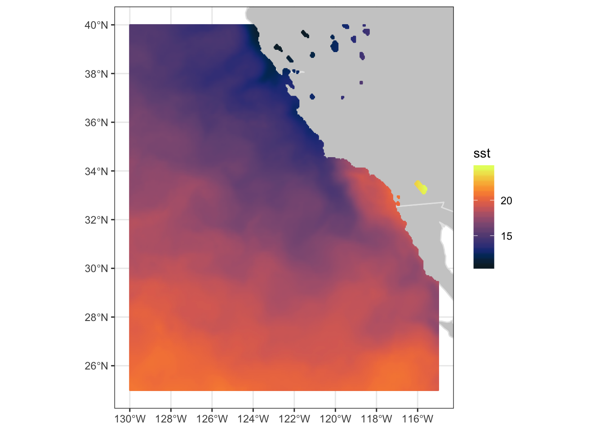
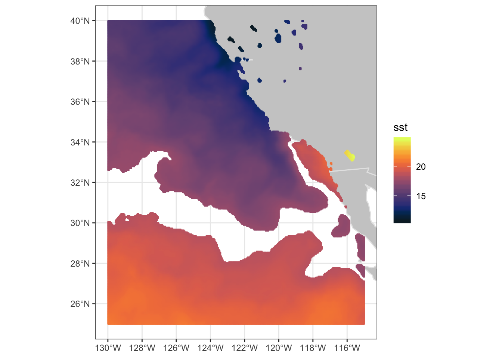
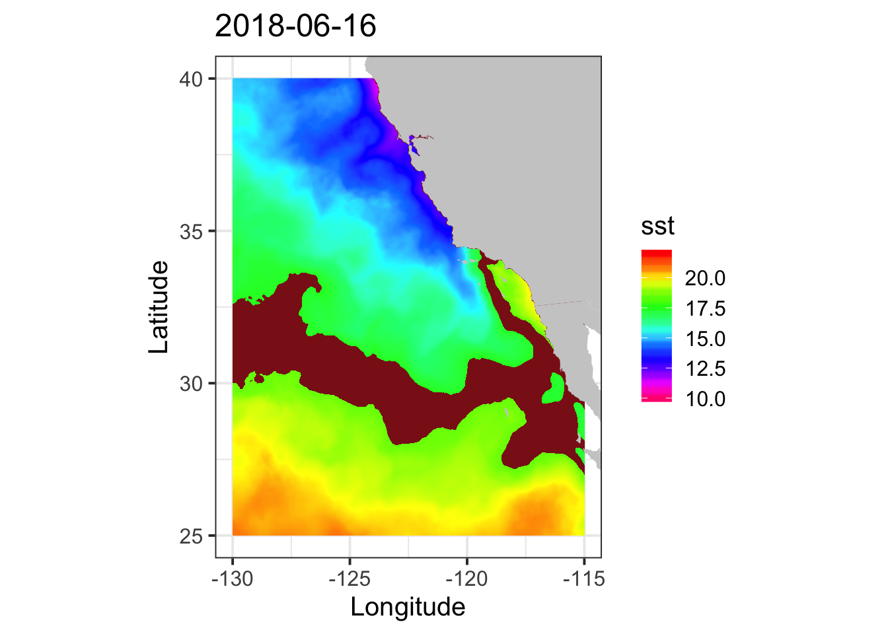

# Chapter 6 TurtleWatch

> notebook filename \| 07\_turtlewatch\_xtracto.Rmd

##  Install required packages and load libraries

```text
# Function to check if pkgs are installed, install missing pkgs, and load
pkgTest <- function(x)
{
  if (!require(x,character.only = TRUE))
  {
    install.packages(x,dep=TRUE,repos='http://cran.us.r-project.org')
    if(!require(x,character.only = TRUE)) stop(x, " :Package not found")
  }
}

list.of.packages <- c( "ncdf4", "rerddap","plotdap","rerddapXtracto","RCurl",  
                       "raster", "colorRamps", "maps", "mapdata",
                       "ggplot2", "RColorBrewer")

# create list of installed packages
pkges = installed.packages()[,"Package"]

for (pk in list.of.packages) {
  pkgTest(pk)
}
```

##  Select the Satellite Data

* Use the MUR SST dataset \(ID jplMURSST41mday\). 
* Gather information about the dataset \(metadata\) using **rerddap.** 
* Displays the information

```text
# CHOOSE DATASET and get information about it 

dataInfo <- rerddap::info('jplMURSST41mday')
parameter <- 'sst'
```

##  Get Satellite Data

* Select an area off the coast of California: longitude range of -130 to -115 east and latitude range of 25 to 40 north. 
* Set the time range to days withing one month: tcoord=c\(‘2018-06-06’,‘2018-06-08’\)\). The values do have to be different.

```text
# latitude and longitude of the vertices
ylim<-c(25,40)
xlim<-c(-130,-115)

# Choose an area off the coast of California
# Extract the data
SST <- rxtracto_3D(dataInfo,xcoord=xlim,ycoord=ylim,parameter=parameter, 
                   tcoord=c('2018-06-06','2018-06-08'))

# Drop command needed to reduce SST from a 3D                   
SST$sst <- drop(SST$sst) 
```

##  Make a quick plot using plotBBox

```text
plotBBox(SST, plotColor = 'temperature',maxpixels=100000)
```



##  Define the Thermal niche of Loggerhead Turtles

**Set the thermal range to 17.5-18.5 degrees C, as determined by the TurtleWatch program.**

```text
## Define turtle temperature range
min.temp <- 17.5
max.temp <- 18.5
```

**Create another variable for habitat temperature and set the habitat temperature to equal NA**

```text
SST2 <- SST
SST2$sst[SST2$sst >= min.temp & SST2$sst <= max.temp] <- NA
plotBBox(SST2, plotColor = 'temperature',maxpixels=100000)
```



It would be nicer to color in the turtle habitat area \(the NA values\) with a different color. If you want to customize the graphs its better to use `ggplot` that the `plotBBox` that comes with `rerrdapXtracto` package. Here we will use `ggplot` to plot the data. But first the data is reformatted for use in `ggplot`.

**Restructure the data**

```text
dims <- dim(SST2$sst)
SST2.lf <- expand.grid(x=SST$longitude,y=SST$latitude)
SST2.lf$sst<-array(SST2$sst,dims[1]*dims[2])

```

##  Plot the Data using ‘ggplot’

```text
coast <- map_data("worldHires", ylim = ylim, xlim = xlim)

par(mar=c(3,3,.5,.5), las=1, font.axis=10)

myplot<-ggplot(data = SST2.lf, aes(x = x, y = y, fill = sst)) +
  geom_tile(na.rm=T) +
  geom_polygon(data = coast, aes(x=long, y = lat, group = group), fill = "grey80") +
  theme_bw(base_size = 15) + ylab("Latitude") + xlab("Longitude") +
  coord_fixed(1.3,xlim = xlim, ylim = ylim) +
  ggtitle(unique(as.Date(SST2$time))) +
  scale_fill_gradientn(colours = rev(rainbow(12)),limits=c(10,22),na.value = "firebrick4") 

myplot
```



