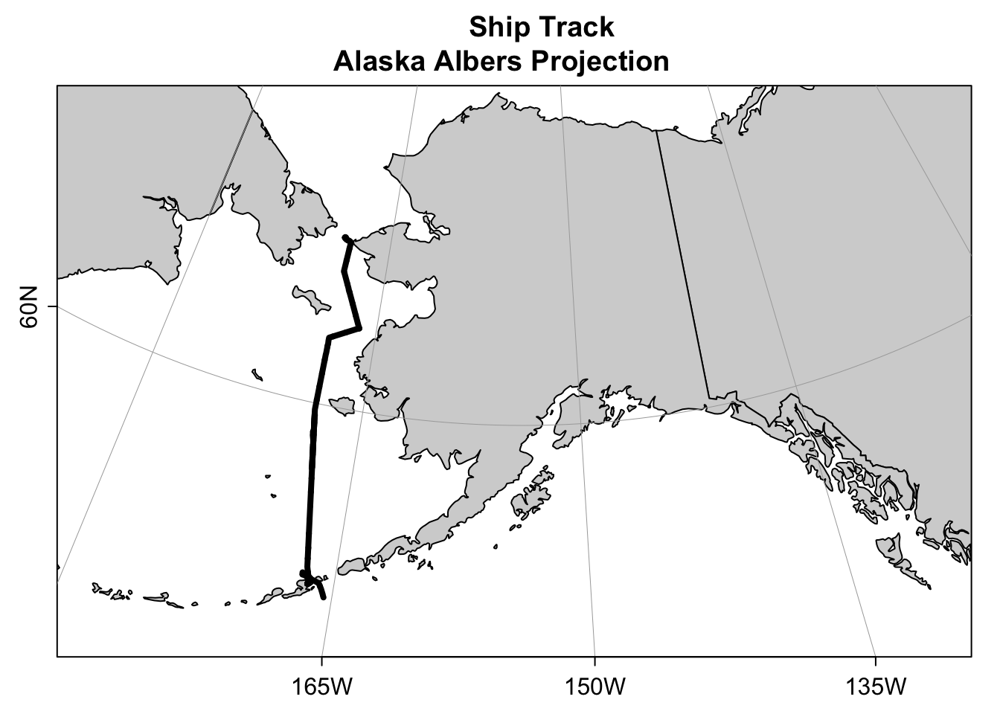
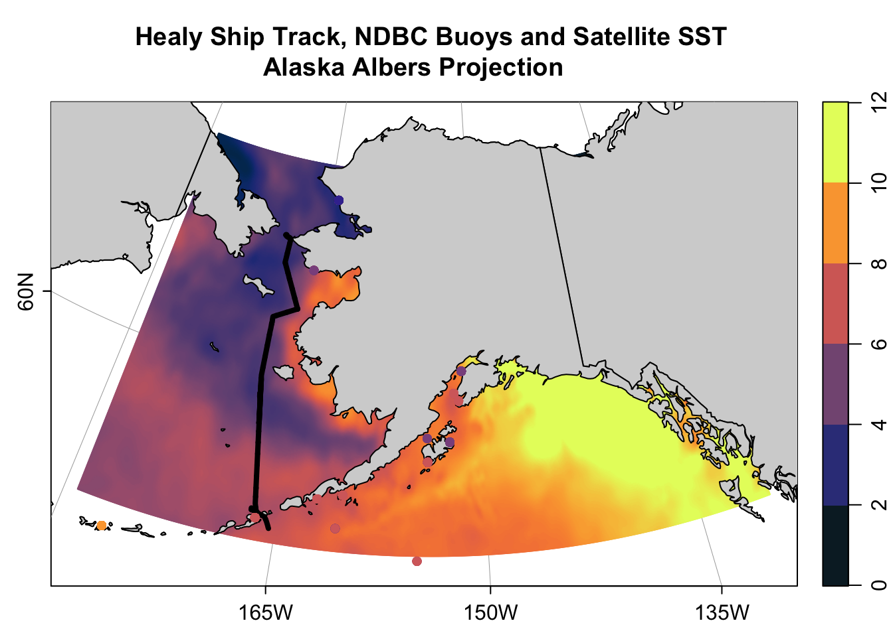

# Chapter 7 Reprojecting satellite and buoy data

> notebook filename \| 07\_projected\_maps\_buoys.Rmd

This exercise demonstrates collecting satellite and in-situ buoy data as ancillary data that complement the mission of a research cruise. We will download the cruise track, satellite, and buoy data from ERDDAP and then map all of the data in an Alaska Albers projection.

The exercise demonstrates the following techniques:

* Finding and accessing in-situ buoy data in ERDDAP 
* Accessing satellite data from ERDDAP 
* Making projected maps of ship tracks, buoy locations and satellite data

The exercise demonstrates the following packages/functions:

* **rerddap::info** - to retrieve information about a dataset from ERDDAP 
* **rerddapXtracto::xtracto\_3D** - to extract satellite data from ERDDAP 
* **rerddap::tabledap** - to extract ship track and buoy data from ERDDAP 
* **oce** - to plot data from ERDDAP on a projected map

This exercise accesses the following datasets:

* NOAA Geo-polar Blended Sea Surface Temperature daily satellite data, ‘nesdisGeoPolarSSTN5NRT’ 
* NDBC Buoys, ‘cwwcNDBCMet’ 
* A Ship Track from the R/V Healy ‘fsuResearchShipNEPP’

These datasets are all provided in ERDDAP with lat-lon coordinates. For an example of working with datasets provided in projected \(ie. polar stereographic\) coordinates see \(insert link to projected datasets notebook\)

##  Install required packages and load libraries

```text
# Function to check if pkgs are installed, install missing pkgs, and load
pkgTest <- function(x)
{
  if (!require(x,character.only = TRUE))
  {
    install.packages(x,dep=TRUE)
    if(!require(x,character.only = TRUE)) stop(x, " :Package not found")
  }
}

list.of.packages <- c( "ncdf4","parsedate", "rerddap","plotdap","sp","rerddapXtracto","httr",
                       "lubridate", "gridGraphics",  "mapdata", "cmocean",
                       "ggplot2", "RColorBrewer", "grid", "PBSmapping", "oce", 
                       "ocedata")
# create list of installed packages
pkges = installed.packages()[,"Package"]
for (pk in list.of.packages) {
  pkgTest(pk)
}
```

##  Ship Track

Get a track from the research ship Healy in Alaska. This dataset is in the PolarWatch ERDDAP with dataset id ‘fsuResearchShipNEPP’. Here we pull the track for a segment of data from June 2011.

**Visualize the ship track**

Here we demonstrate viewing the track in Alaska Albers projection which is commonly used by local scientists. See the Fish and Wildlife reference link for more info on projections in Alaska.

The **oce** package is great for making maps in a variety of projections. The **oce::mapPlot** function accepts projections in a number of formats, see the mapPlot reference below for more details. Here we specify the projection with the proj4 string for Alaska Albers EPSG:6393.

```text
# define map extents
ylim <- c(53,69)
xlim <- c(-179,-130)
data("coastlineWorldMedium") # included in ocedata

# set plot margins
par(mar=c(2, 2, 3, 1))

# define projection with proj4 string for Alaska Albers EPSG:6393
epsg6393 = '+proj=aea +lat_1=55 +lat_2=65 +lat_0=50 +lon_0=-154 +x_0=0 +y_0=0 +ellps=GRS80 +units=m +no_defs' 

## make a base
mapPlot(coastlineWorldMedium, 
        projection=epsg6393,
        col="lightgray", 
        longitudelim=xlim, 
        latitudelim=ylim, 
        clip = TRUE,
        main="         Ship Track  \n   Alaska Albers Projection      "
        )

## add ship track
mapLines(longitude = as.numeric(ship.df$longitude), 
         latitude = as.numeric(ship.df$latitude), 
         col = "black", lwd = 4)
```



##  Add Nearby Buoy locations

See if any NDBC buoys have data available in this area and add them to the map. Request NDBC buoy data with the **rerddap::tabledap** function, using the same temporal and spatial coverages as our satellite data request. Here we request the station, latitude, longitude, and time and then put the data into a data frame.

```text
buoysDatasetId <- 'cwwcNDBCMet'

# Request the NDBC buoy data
buoys <- tabledap(
  buoysDatasetId, 
  fields=c('station', 'latitude',  'longitude', 'time', 'wtmp'), 
  'time>=2011-06-21',   'time<=2011-06-29', 
  'latitude>=50','latitude<=70', 
  'longitude>=-179','longitude<=-150'
)
buoys$wtmp <- as.numeric(buoys$wtmp)

# Create dataframe 
buoys.df <-data.frame(
  station=buoys$station,
  longitude=as.numeric(buoys$longitude),
  latitude=as.numeric(buoys$latitude),
  time=strptime(buoys$time, "%Y-%m-%dT%H:%M:%S"),
  sst=as.numeric(buoys$wtmp),
  col=as.numeric((buoys$wtmp-min(buoys$wtmp,na.rm=T))/max(buoys$wtmp,na.rm=T))
  )
# Subset buoys to only show those with data at night, to correspond with the satellite data. 
# Night hours are 2000 - 0700 local = (0400 - 1500 GMT)
nightbuoy.df <- subset(buoys.df,hour(time)==8)
#nightbuoy.df <- subset(nightbuoy.df,hour(time)<15)

#set sst colors to scale of 0 to 1
nightbuoy.df$col[nightbuoy.df$col <= 0] = 0
nightbuoy.df$col[nightbuoy.df$col > 1] = 1

# See how many buoys were found
length(unique(nightbuoy.df$station))
```

```text
## [1] 22
```

**Make a map with both the ship track and buoy locations**


```text
## draw scalebar
Zlim = c(0,12)

drawPalette(zlim = Zlim, 
            breaks = seq(0,12,2),
            col= oceColorsTemperature, 
            at = seq(0,12,2), 
            pos = 4, 
            drawTriangles = FALSE)

## make a base
mapPlot(coastlineWorldMedium, 
        projection=epsg6393,
        col="lightgray", 
        longitudelim=xlim, 
        latitudelim=ylim, 
        clip = TRUE,
        main="Healy Track and NDBC Buoys \n   Alaska Albers Projection      "
        )

## add ship track
mapLines(longitude = as.numeric(ship.df$longitude), 
         latitude = as.numeric(ship.df$latitude), 
         col = "black", lwd = 4)

numColors <- 6 
mypalette <- rev(cmocean('thermal')(numColors))

## add the locations of the NDBC buoys

# mapPoints(longitude = buoys.df$longitude, 
#           latitude = buoys.df$latitude, 
#           col = "#0099cc", pch = 20, cex = 1.25)

mapPoints(longitude = nightbuoy.df$longitude, 
          latitude = nightbuoy.df$latitude, 
          col = mypalette[as.integer(1+(numColors-1)*nightbuoy.df$col)], 
          pch = 20, cex = 1.25)
```

##  Add Satellite SST Data

* Request metadata for the Geo-Polar Blended SST dataset using the **rerddap::info** function.
* Use the returned info about dimensions and variable names to form a data request.
* The satellite dataset id is **nesdisGeoPolarSSTN5NRT**

```text
##  nesdisGeoPolarSSTN5SQNRT 
##  Base URL: https://upwell.pfeg.noaa.gov/erddap/ 
##  Dimensions (range):  
##      time: (2002-09-01T12:00:00Z, 2020-04-03T12:00:00Z) 
##      latitude: (-89.975, 89.975) 
##      longitude: (-179.975, 179.975) 
##  Variables:  
##      analysed_sst: 
##          Units: degree_C 
##      analysis_error: 
##          Units: degree_C 
##      mask: 
##      sea_ice_fraction: 
##          Units: 1
```

**Extract Satellite SST Data**

Using information returned from the **rerddap::info** request, form a data request using **rerddapXtracto::rxtracto\_3D**. Here we request SST data for June 24, 2011 using the same extents that we used to define our map.

**Make Map with Ship Track, Buoys and Satellite SST**

```text
# set plot margins
par(mar=c(2, 2, 4, 1))

## draw scalebar
Zlim = c(0,12)

drawPalette(zlim = Zlim, 
            breaks = seq(0,12,2),
            col= oceColorsTemperature, 
            at = seq(0,12,2), 
            pos = 4, 
            drawTriangles = FALSE)

## make a base
mapPlot(coastlineWorldMedium, 
        projection=epsg6393,
        col="lightgray", 
        longitudelim=xlim, 
        latitudelim=ylim, 
        clip = TRUE,
        main="   Healy Ship Track, NDBC Buoys and Satellite SST \n   Alaska Albers Projection      "
        )

## overlay gridded sst layer
## The oce package incorporates cmocean colormaps
mapImage(longitude = satMap$longitude,
         latitude = satMap$latitude, 
         z = satMap$analysed_sst[,,1], 
         zlim = Zlim,
         col = oceColorsTemperature)

## add a land polygon on top of the data
mapPolygon(coastlineWorldMedium, 
        col="lightgray")

## add ship track
mapLines(longitude = as.numeric(ship.df$longitude), 
         latitude = as.numeric(ship.df$latitude), 
         col = "black", lwd = 4)

# create points colormap
numColors <- 6 
pointsPalette <- rev(cmocean('thermal')(numColors))

mapPoints(longitude = nightbuoy.df$longitude, 
          latitude = nightbuoy.df$latitude, 
          col = pointsPalette[as.integer(1+(numColors-1)*nightbuoy.df$col)], 
          pch = 20, 
          cex = 1.25)
```



##  References

Dan Kelley, OCE Vignettes - Using Map Projections,Feb 21, 2020, [https://cran.r-project.org/web/packages/oce/vignettes/map\_projections.html](https://cran.r-project.org/web/packages/oce/vignettes/map_projections.html)

Dan Kelley, R Documentation from oce v1.2.0, mapPlot function, accessed March 11, 2020, [https://www.rdocumentation.org/packages/oce/versions/1.2-0/topics/mapPlot](https://www.rdocumentation.org/packages/oce/versions/1.2-0/topics/mapPlot)

Masumbuko Semba, Mapping with oce, 2/13/2019, [https://semba-blog.netlify.com/02/13/2019/mapping-with-oce/](https://semba-blog.netlify.com/02/13/2019/mapping-with-oce/)

U.S. Fish and Wildlife Service Alaska Region, A Geodesy Primer, November 08, 2019, [https://www.fws.gov/r7/nwr/Realty/data/LandMappers/Public/Help/HTML/R7-Public-Land-Mapper-Help.html?Datumsprojectionsandcoordinatesy.html](https://www.fws.gov/r7/nwr/Realty/data/LandMappers/Public/Help/HTML/R7-Public-Land-Mapper-Help.html?Datumsprojectionsandcoordinatesy.html)

