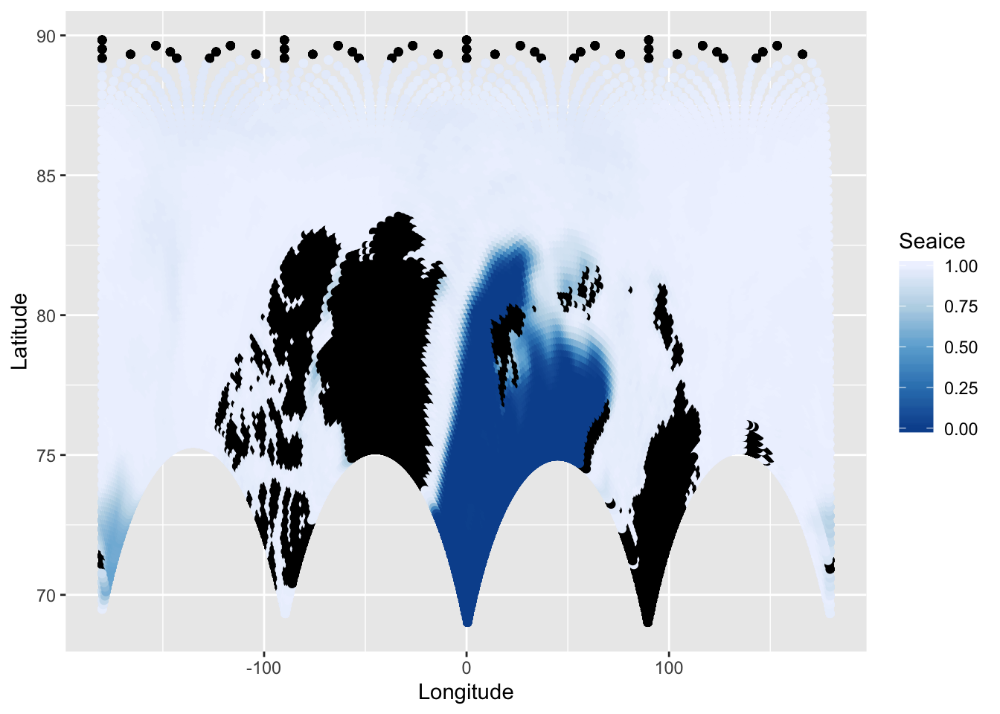
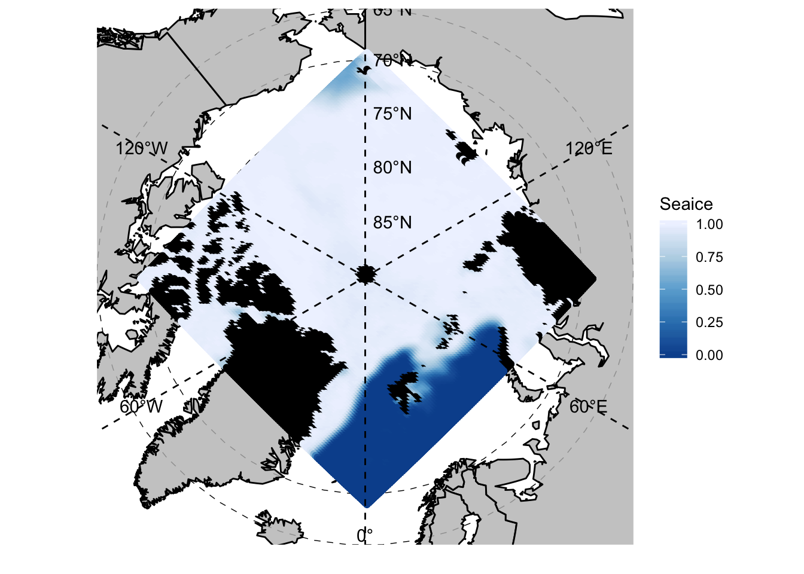
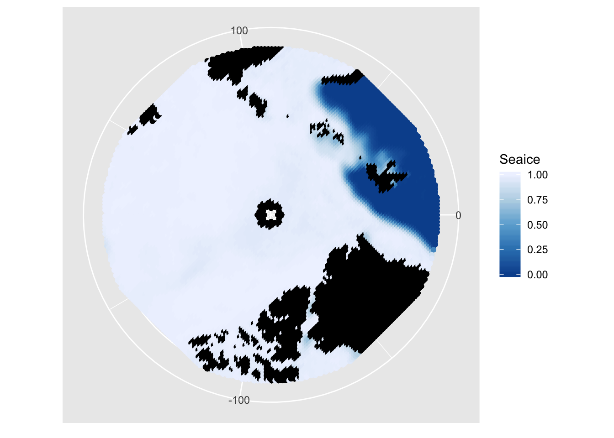

# Chapter 8 Mapping projected datasets

> notebook filename \| 08\_projected\_dataset.Rmd

This example demonstrates the following techniques for working with sea ice data served in polar projected coordinates:

* Finding and previewing sea ice data in ERDDAP
* Creating URL requests to download projected data from ERDDAP
* Using the latitude/longitude grids associated with a projected dataset
* Making maps of projected data with **ggplot**

This example works with data provided in ERDDAP with projected coordinates \(polar stereographic\). For an example of reprojecting data onto maps for datasets having latitude and longitude geographic coordinates, see the `Mapping projected datasets` section of the course book.

##  Install required packages and load libraries

```text
# Function to check if pkgs are installed, install missing pkgs, and load
pkgTest <- function(x)
{
  if (!require(x,character.only = TRUE))
  {
    install.packages(x,dep=TRUE,repos='http://cran.us.r-project.org')
    if(!require(x,character.only = TRUE)) stop(x, " :Package not found")
  }
}

list.of.packages <- c("ncdf4","openair","ggplot2","reshape2","scales","lubridate",
                      "cmocean","maps","mapdata","rgdal","raster","RColorBrewer", "sp")

# create list of installed packages
pkges = installed.packages()[,"Package"]
for (pk in list.of.packages) {
  pkgTest(pk)
}
```

##  Find and explore the ice datasets online in ERDDAP

In this example, we will use the NSIDC Sea Ice Concentration Climate Data Record \(CDR\) as our demonstration projected dataset. This dataset is in a polar stereographic projection, where the coordinates are given as meters from a central point \(the north pole\) instead of as latitude and longitude. Corresponding latitude and longitude grids enable easily moving between projected coordinates and latitude/longitude.

**Search for the NSIDC CDR sea ice datasets**

Use a web browser to go to the PolarWatch ERDDAP at `https://polarwatch.noaa.gov/erddap/`

In the search box type **NSIDC CDR** and click the `Search` button

A list of datasets will load, including:

* Near-real-time data from the Northern and Southern Hemispheres
* Science quality data from the Northern and Southern Hemispheres
* The latitude and longitude grid for the Arctic

We will use the monthly science quality dataset for the Northern Hemisphere \(ERDDAP ID = nsidcCDRiceSQnhmday\) and the associated lat-lon grid dataset for the Arctic \(ERDDAP ID = nsidcCDRice\_nh\_grid\).


**Preview the data**

From the dataset listing, click on the **graph** link to the left of the dataset title. Using the selectors on the left you can quickly preview maps of the data for your times of interest.

You can generate a URL for a netCDF download of the data for the previewed image by setting the file type to .nc which will display a download URL which can be used in a script.


**View the detailed metadata**

From the dataset listing, click on the **M** \(metadata\) link to the right of the dataset title. This page will show details about the dataset including the projection. We can see that this is a polar stereographic projection with EPSG code 3411 and also the proj4 string for the dataset. In this case the projection is NSIDC Polar Stereographic North.


The metadata page provides important information about the dataset such as projection details.

**Generate a URL as a starting point for scripting**

From the dataset listing, click on the **data** link to the left of the dataset title. We can use the data page to generate a generic url for a netCDF file download. Copy and paste the generated URL into your script, we will use the url as a starting point for forming a data request in R.

Below is an example of data request URL from the ERDDAP data access form

> `https://polarwatch.noaa.gov/erddap/griddap/nsidcCDRiceSQnhmday.nc?`  
>  `seaice_conc_monthly_cdr`  
>  `[(2017-12-16T00:00:00Z):1:(2017-12-16T00:00:00Z)]` `[(5837500.0):1:(-5337500.0)][(-3837500.0):1:(3737500.0)],`  
>  `goddard_merged_seaice_conc_monthly`  
>  `[(2017-12-16T00:00:00Z):1:(2017-12-16T00:00:00Z)]` `[(5837500.0):1:(-5337500.0)][(-3837500.0):1:(3737500.0)]`


Obtain a URL for a data download from the ERDDAP data access web page

##  Download the sea ice concentration data

We will now use R and the ERDDAP API to generate a sea ice data request. Subsetting data from a projected dataset requires a few more steps than most ERDDAP datasets. Projected datasets served in the PolarWatch ERDDAP are also served with a corresponding lat-lon grid. In this section, we will demonstrate using the lat-lon grid to make a data request for the projected ice data with the following steps:

* Download a netCDF file of the lat/lon grid from ERDDAP
* Use the grid to find the x and y indices that correspond with your area of interest
* Request the sea ice concentration dataset using the selected indices from the lat/lon grid
* Read the downloaded netCDF data file and load the ice data into R variables

**Download a netCDF file of the lat-lon grid from ERDDAP**

First, we form a request for the full lat-lon grid using the dataset id **nsidcCDRice\_nh\_grid** and the default axis extent values. As demostrated previously, we can use a download URL from the lat-lon grid data access page as a template for data requests in R. Then we’ll download the data and read the netCDF file variables into R.

```text
# Download the lat-lon grid
# Use the dataset id 'nsidcCDRice_nh_grid' and the default axis extent values

url <- 'https://polarwatch.noaa.gov/erddap/griddap/'

grid_id <- 'nsidcCDRice_nh_grid'

grid_urlcall <- paste0(url,grid_id,'.nc?longitude[(5812500.0):1:(-5337500.0)][(-3837500.0):1:(3737500.0)],latitude[(5812500.0):1:(-5337500.0)][(-3837500.0):1:(3737500.0)]')

grid_nc <- download.file(grid_urlcall,destfile="grid.nc",mode='wb')

# Read the grid file
gridFid <- nc_open('grid.nc')
ygrid <- ncvar_get(gridFid, varid="ygrid")
xgrid <- ncvar_get(gridFid, varid="xgrid")
longitude <- ncvar_get(gridFid, varid="longitude")
latitude <- ncvar_get(gridFid, varid="latitude")
nc_close(gridFid)
```

**Find the x and y indices that correspond with your area of interest**

Next we will get the indices of our area of interest. We will use these indices later to make subsetted data requests. For this example we are interested in all data north of 75°. We will find all coordinate values greater than or equal to 75°N. To subset by longitude you can add a longitude query. The range is an extent that covers all data north of 75° so we will be requesting the smallest box of data that covers our desired latitude range. Note that our returned request will include points south of 75°N to accomplish this.

```text
inds = which(latitude > 75, arr.ind=TRUE)
rowrange <- range(inds[,1])
colrange <- range(inds[,2])
```

**Request the sea ice dataset using the selected indices from the lat/lon grid**

Request data from the monthly science quality dataset for the Northern Hemisphere \(**nsidcCDRiceSQnhmday**\). There are four different sea ice variables in this dataset. Downloading each of them requires adding the name of each variable and the date and coordinate constraints. Here we download two of the variables. If you need a refresher on the structure of the URL call, go to the ERDDAP “Data Access Form” for a dataset and use the ‘generate the URL’ button.

```text
#Generate a data request URL using the indices from the grid

dataid <- 'nsidcCDRiceSQnhmday'
varnames <- c('seaice_conc_monthly_cdr','goddard_merged_seaice_conc_monthly')
datestring <- '[(1997-01-16T00:00:00Z):1:(2017-12-16T00:00:00Z)]'
coordstring <- paste0('[',colrange[1],':1:',colrange[2],'][',rowrange[1],':1:',rowrange[2],']')

for (i in 1:length(varnames)) {
   if (i == 1) {
     urlcall <- paste0(url,dataid,'.nc?',varnames[i],datestring,coordstring)
     } 
   else {
     urlcall <- paste0(urlcall,',',varnames[i],datestring,coordstring)
     }
}

#Download the netCDF file  (this will take a few minutes, 20 years of data)
data_nc <- download.file(urlcall,destfile="data.nc",mode='wb')
```

**Read the downloaded netCDF file and load the ice data into R variables**

```text
dataFid <- nc_open('data.nc')

datatime <- ncvar_get(dataFid, varid="time")
datatime <- as.Date(as.POSIXlt(datatime,origin='1970-01-01',tz= "GMT"))

ygrid <- ncvar_get(dataFid, varid="ygrid")
xgrid <- ncvar_get(dataFid, varid="xgrid")

seaiceCDR <- ncvar_get(dataFid, varid=varnames[1])
seaiceGoddard <- ncvar_get(dataFid, varid=varnames[2])

nc_close(dataFid)
```

##  Make maps of the ice data

The exercise will demonstrate four different ways to map the data, because with R there is always more than one way to do things! The first three methods will use the latitude and longitude coordinates while the fourth method uses the projected coordinates. All methods use **ggplot**.

### **Prepare to make the maps**

We now have the ice data in R, but there are a few things we need to do before we can make the map plots:

* Generate the subsetted latitude and longitude grids that correspond to our ice data request. We will use these grids in the first three examples.
* Choose the date that we want to plot
* Reformat our data into a dataframe for plotting

```text
# Request a grid subset using the same coordinate string used for the data download. 
urlcall <- paste0(url,grid_id,'.nc?longitude',coordstring,',latitude',coordstring) 
grid_subset <- download.file(urlcall,destfile="grid_subset.nc",mode='wb')

# Read and format the subsetted grid data from the netCDF file  

gridSubsetFid <- nc_open('grid_subset.nc')

ygrid <- ncvar_get(gridSubsetFid, varid="ygrid")
xgrid <- ncvar_get(gridSubsetFid, varid="xgrid")
longitudeSubset <- ncvar_get(gridSubsetFid, varid="longitude")
latitudeSubset <- ncvar_get(gridSubsetFid, varid="latitude")

nc_close(gridSubsetFid)
```

Choose a date to use for the map and determine the index value for the date

```text
plotdate <- '2017-12-01'
idate = which((month(datatime)==month(plotdate)) & (year(datatime)==year(plotdate)))
```

Make a long-format dataframe for that time period to use with ggplot

```text
dims <- dim(longitude)
icemap.df <- data.frame(Longitude=array(longitudeSubset,dims[1]*dims[2]),
                        Latitude=array(latitudeSubset,dims[1]*dims[2]))
icemap.df$Seaice <- array(seaiceCDR[,,idate],dims[1]*dims[2])
```

This dataset has a fill value of 2.54 which represents a land mask. Replace that with NA before plotting.

```text
icemap.df$Seaice[icemap.df$Seaice > 2] <- NA 
```

### **Create a map with a geographical grid**

See how **ggplot** plots the dataset as a standard geographical lat/lon plot.

```text
ggplot(aes(x = Longitude, y = Latitude), data = icemap.df) + 
       geom_point(aes(color=Seaice)) + 
       scale_color_gradientn(colours=rev(brewer.pal(n = 5, name = "Blues")),na.value="black") 
```



### Map with a polar view

Follow the example at [https://stackoverflow.com/questions/48816773/polar-stereographic-map-in-r](https://stackoverflow.com/questions/48816773/polar-stereographic-map-in-r)

```text
data("wrld_simpl", package = "maptools")                                                                            
wm <- ggplot2::map_data(wrld_simpl)

x_lines <- seq(-120,180, by = 60) # for longitude indicator lines and labels
x_labels <- seq(-120,120, by = 60)

ggplot() +
  geom_polygon(data = wm, aes(x = long, y = lat, group = group), 
               fill = "grey", colour = "black", alpha = 0.8) +
 
  # Add data overlay 
  geom_point(data=icemap.df, aes(x = Longitude, y = Latitude, color=Seaice)) + 
       scale_color_gradientn(colours=rev(brewer.pal(n = 5, name = "Blues")),na.value="black") + 
  
  # Set plot to polar coordinates
  # setting the southward boundary to 65 deg N allows us to see the full extent of the returned data 
  coord_map("ortho", orientation = c(90, 0, 0), xlim = c(-180, 180), ylim = c(65, 90)) +
  scale_y_continuous(breaks = seq(65, 90, by = 5), labels = NULL) +

  # Removes Axes and labels
  scale_x_continuous(breaks = NULL) +
  xlab("") + 
  ylab("") +

  # Adds labels
  #longitudes
  geom_text(aes(x = x_labels, y = 66, label = c("120°W", "60°W", "0°", "60°E", "120°E"))) +
  #latitudes
  geom_text(aes(x = 180, y = seq(65, 85, by = 5), hjust = -0.2, label = paste0(seq(65, 85, by = 5), "°N"))) +

  # Adds axes
  geom_hline(aes(yintercept = 60), size = 1)  +
  geom_segment(aes(y = 60, yend = 90, x = x_lines, xend = x_lines), linetype = "dashed") +

# Remove edge axes and ticks
theme(panel.background = element_blank(),
      panel.grid.major = element_line(size = 0.25, linetype = 'dashed',
                                      colour = "black"),
      axis.ticks=element_blank())  
```



### Create a map with a clipped polar view

Follow the example given at [https://www.r-bloggers.com/drawing-polar-centered-spatial-maps-using-ggplot2/](https://www.r-bloggers.com/drawing-polar-centered-spatial-maps-using-ggplot2/) Note the **opts** function has been deprecated, and **theme** is now used instead.

```text
res <- 1 # 1 degree resolution
x_cell_lim <- c(180, -180) + c(1, -1) * res/2
y_cell_lim <- c(90, 75) + c(1, -1) * res/2
 
ggplot(aes(x = Longitude, y = Latitude), data = icemap.df) + 
       geom_point(aes(color=Seaice)) + 
       scale_color_gradientn(colours=rev(brewer.pal(n = 5,  name="Blues")),na.value="black") +
      coord_polar(start = -pi/2) +
       xlim(x_cell_lim) + ylim(y_cell_lim) + 
       theme(axis.title.y = element_blank(), axis.title.x = element_blank(), 
       axis.ticks = element_blank(), axis.text.y = element_blank(), 
       panel.border = element_blank())
```



### Create a map using projected coordinates

Finally, if you don’t need to work with lat/lon coordinates you can plot the data in projected coordinates using the **xgrid** and **ygrid** variables.

```text
dims <- dim(xgrid)
icemap2 <- expand.grid(xgrid=xgrid,ygrid=ygrid)
icemap2$Seaice <- array(seaiceCDR[,,idate],dim(xgrid)*dim(ygrid))

icemap2$Seaice[icemap2$Seaice > 2] <- NA 

ggplot(aes(x = xgrid, y = ygrid, fill=Seaice), data = icemap2) + 
       geom_tile() + coord_fixed(ratio = 1) + scale_y_continuous(labels = comma) + scale_x_continuous(labels = comma) +
       scale_fill_gradientn(colours=rev(brewer.pal(n = 5, name = "Blues")),na.value="black") 
```


